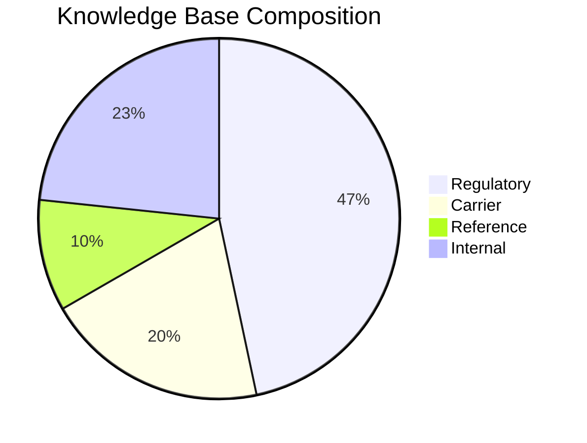
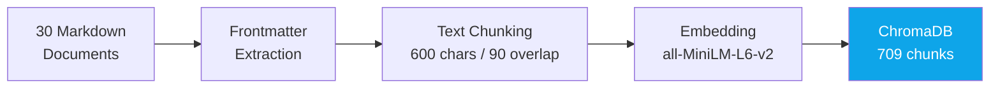
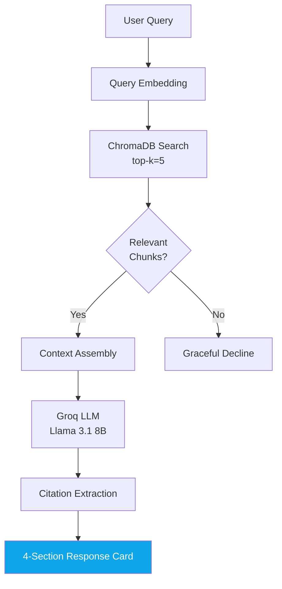

# Task 5.4 — Create React Presentation App (16 Slides)

## Persona
Frontend engineer building a standalone React presentation app that replaces PowerPoint for the Waypoint POC stakeholder demo. The app must be visually polished, technically accurate, and independently deployable.

## Context

### Workspace
- **Location**: `pilot_phase1_poc/05_evaluation/demo/presentation/`
- **Current state**: Empty `src/` dir, `public/demo/screenshots/` populated (25 screenshots from Task 5.3)
- **Independent project**: Own `package.json`, own Vite + Tailwind config, NOT sharing deps with the main app

### Screenshot Assets (from Task 5.3)
- `public/demo/screenshots/manifest.json` — JSON listing 10 queries with filenames
- `public/demo/screenshots/demo_NN_typed.png` — 10 "typed state" screenshots
- `public/demo/screenshots/demo_NN_response.png` — 10 "response state" screenshots
- `public/demo/screenshots/demo_NN_response_full.png` — 5 full-page screenshots (Demos 1, 3, 4, 5, 6)

### Project Metrics (for slide content)
| Metric | Target | Achieved |
|--------|--------|----------|
| Deflection Rate | >=40% | 87.2% |
| Citation Accuracy | >=80% | 96.0% |
| Hallucination Rate | <15% | 2.0% |
| OOS Handling | >=90% | 100.0% |
| Avg Latency | <5s | 1,182ms |
| System Stability | No crashes | Stable |

### Tech Stack for Slide Content
| Component | Technology |
|-----------|------------|
| Vector DB | ChromaDB 0.5.23 (local) |
| Embeddings | all-MiniLM-L6-v2 via ONNX (384-d) |
| Document Processing | Python 3.11+ |
| Backend | Express (Node.js 18+) |
| Frontend | React + Tailwind |
| LLM | Groq API (Llama 3.1 8B Instant) |
| Tests | 217 total (pytest + Jest + Vitest) |
| KB | 30 docs, 709 chunks |

## Task

### Step 1: Initialize Vite Project

```bash
cd pilot_phase1_poc/05_evaluation/demo/presentation
npm create vite@latest . -- --template react
npm install
npm install -D tailwindcss @tailwindcss/vite
npm install framer-motion mermaid
```

**Important**: Do NOT use `react-mermaidjs` — use `mermaid` directly (simpler, fewer deps). Initialize mermaid in a wrapper component.

Configure Tailwind via `@tailwindcss/vite` plugin (Tailwind v4 CSS-first approach — no `tailwind.config.js` needed, use `@import "tailwindcss"` in CSS).

If Tailwind v4 CSS-first causes issues, fall back to Tailwind v3 with the classic `tailwind.config.js` + `@tailwind` directives approach.

### Step 2: Build Presentation Shell

**File structure**:
```
src/
  App.jsx              — Slide router + keyboard nav
  index.css            — Tailwind imports + presentation styles
  components/
    SlideLayout.jsx    — Common slide frame (title, content, footer, progress)
    MermaidDiagram.jsx — Mermaid wrapper (init + render)
    MetricCard.jsx     — Animated metric display (number + label + bar)
    ImageCarousel.jsx  — Screenshot carousel for Slide 10
  slides/
    Slide01_Title.jsx
    Slide02_Problem.jsx
    Slide03_Solution.jsx
    Slide04_TechStack.jsx
    Slide05_KnowledgeBase.jsx
    Slide06_DataPipeline.jsx
    Slide07_RAGPipeline.jsx
    Slide08_ResponseUX.jsx
    Slide09_Demo.jsx
    Slide10_Results.jsx
    Slide11_Timeline.jsx
    Slide12_Limitations.jsx
    Slide13_Recommendations.jsx
    Slide14_QA.jsx
    index.js           — Export all slides as array
```

### Step 3: Navigation System

**App.jsx** requirements:
- `useState` for current slide index (0-based)
- **Keyboard**: Left/Right arrows, Home/End, Escape (show slide list)
- **Click**: Left/right arrow buttons in corners (subtle, appear on hover)
- **Progress bar**: Thin bar at bottom showing current position
- **Slide counter**: "3 / 14" in bottom-right corner
- **Transition**: Use `framer-motion` `AnimatePresence` for slide transitions (simple fade or slide-left)
- **URL hash**: Update `#slide-N` on navigation for bookmarking

### Step 4: Build 14 Slides

**Note**: The roadmap lists 16 slides but includes 7a/7b as separate slides. Consolidating to 14 actual slides (merging some content). Adjust if you prefer 16.

---

#### Slide 1 — Title
- Large "Waypoint Co-Pilot" title with gradient text (sky-500 to blue-600)
- Subtitle: "RAG-Based Customer Service Assistant for Freight Forwarding"
- "Phase 1 POC — Complete" badge
- "All 6 Evaluation Targets Met" highlight
- Bottom: "February 2026"
- **Diagram**: None (clean title slide)

---

#### Slide 2 — The Problem
- Header: "The Challenge"
- 3-4 pain points with icons:
  - CS agents spend 15-20 min searching across PDFs, portals, internal docs
  - Singapore customs rules change frequently — outdated answers cause compliance issues
  - Carrier-specific procedures (VGM, SI cutoffs) scattered across multiple sources
  - No single source of truth for internal policies (SLA, booking procedures)
- **Diagram**: Framer Motion — animate pain points appearing one by one (stagger)

---

#### Slide 3 — The Solution (Before/After)
- Split layout:
  - **Before**: Scattered documents, manual search, inconsistent answers (grey/muted)
  - **After**: Single query box, instant sourced answers, confidence indicator (sky/blue/vibrant)
- Show the 4-section response card concept
- **Diagram**: Framer Motion — animate the transformation (before fades out, after slides in)

---

#### Slide 4 — Tech Stack
- Visual blocks showing components:
  - **Left column** (Data layer): ChromaDB, all-MiniLM-L6-v2, Python 3.11
  - **Center** (API layer): Express / Node.js 18
  - **Right column** (UI layer): React, Tailwind CSS
  - **Top** (LLM): Groq API (Llama 3.1 8B)
- Key stats: "Fully local except LLM", "No PyTorch/CUDA required", "$0 infrastructure cost"
- **Diagram**: Framer Motion — blocks appear and connect with animated lines

---

#### Slide 5 — Knowledge Base
- "30 Documents, 709 Chunks, 4 Categories"
- Category breakdown with icons:
  - Regulatory (14 docs) — SG Customs, ASEAN trade, import/export
  - Carrier (6 docs) — Maersk, PIL, ONE, SIA Cargo, Hapag-Lloyd, Evergreen
  - Reference (3 docs) — Incoterms 2020, HS Codes, Container Specs
  - Internal (7 docs) — SLA, Booking Procedure, Escalation, FAQ
- **Diagram**: Mermaid pie chart or tree diagram showing document distribution



---

#### Slide 6 — Data Pipeline (Ingestion)
- "From Documents to Vectors"
- Step flow: Markdown Docs → YAML Frontmatter Parsing → Text Chunking (600/90) → Embedding (384-d) → ChromaDB Storage
- Key config: CHUNK_SIZE=600, CHUNK_OVERLAP=90, 12 metadata fields per chunk
- **Diagram**: Mermaid flowchart (left to right)



---

#### Slide 7 — RAG Pipeline
- "Query to Answer in 1.2 seconds"
- Step flow: User Query → Embedding → Vector Search (top-k=5) → Context Assembly → LLM (Groq) → Citation Extraction → 4-Section Response
- **Diagram**: Mermaid flowchart (top to bottom)



---

#### Slide 8 — Response UX
- "The 4-Section Response Card"
- Annotated screenshot of Demo 2 (Q-11 GST rate — shows all 4 sections clearly)
- Labels pointing to each section:
  1. **Answer** — Markdown-rendered with headers, lists, bold
  2. **Sources** — Clickable external URLs with org names
  3. **Related Documents** — Color-coded category chips
  4. **Confidence Footer** — Badge + metadata stats
- Use `demo_02_response.png` screenshot with CSS overlay annotations
- **Diagram**: Screenshot with annotation overlays (positioned divs)

---

#### Slide 9 — Live Demo Gallery
- Image carousel showing demo screenshots
- Load from `manifest.json` dynamically
- Show query text above each screenshot
- Auto-advance every 5 seconds or manual prev/next
- Show both typed and response states
- Highlight the 3 OOS examples (Demos 8-10) with a different border color
- **Component**: `ImageCarousel` loading from `public/demo/screenshots/`

---

#### Slide 10 — Results Dashboard
- "All 6 Targets Exceeded"
- 6 metric cards in a 2x3 grid:
  - Each card: metric name, target value (muted), achieved value (large, bold), colored bar showing margin
  - Deflection: 87.2% (target 40%) — emerald
  - Citation: 96.0% (target 80%) — sky
  - Hallucination: 2.0% (target <15%) — emerald
  - OOS: 100.0% (target 90%) — sky
  - Latency: 1,182ms (target 5,000ms) — emerald
  - Stability: No crashes — sky
- **Diagram**: Framer Motion — bars animate from 0 to achieved value on slide enter, numbers count up

---

#### Slide 11 — Timeline
- "4-Week Journey"
- Horizontal timeline with 4 nodes:
  - **Week 1**: Ingestion Pipeline — 29 docs, 400 chunks, 87 tests
  - **Week 2**: RAG Pipeline — Express API, React UI, 162 tests
  - **Week 3**: Retrieval Optimization — 92% hit rate, 709 chunks
  - **Week 4**: Evaluation & Documentation — 6 targets met, 38 docs, 217 tests
- **Diagram**: Framer Motion — timeline nodes light up sequentially on slide enter

---

#### Slide 12 — Known Limitations
- "Honest About Boundaries"
- 3 columns:
  - **By Design (Phase 2)**: No live data, no multi-turn, no auth, SG-only, English-only
  - **Technical**: Single LLM, no fallback, no caching, local-only ChromaDB
  - **Knowledge Base**: 30 docs, 92% hit rate, abbreviation sensitivity
- Clean list format, no diagram

---

#### Slide 13 — Phase 2 Recommendations
- "Where We Go Next"
- Priority tiers:
  - **P1 Must-Have** (5): Live TMS/WMS, multi-turn, auth, expand KB to 80+ docs, Docker deployment
  - **P2 Should-Have** (5): Rate limiting, dynamic ingestion, structured data tables, logging/analytics, confidence recalibration
  - **P3 Nice-to-Have** (4): Citation fuzzy matching, LLM failover, embedding model eval, multi-language
- Color-coded priority badges (red P1, amber P2, green P3)

---

#### Slide 14 — Q&A
- Large "Questions?" centered text
- Key stats recap below:
  - "30 documents | 709 chunks | 92% retrieval | 87% deflection | 96% citation accuracy"
- Contact/repo info if applicable
- Clean, minimal slide

---

### Step 5: Mermaid Wrapper Component

`MermaidDiagram.jsx`:
- Accept `chart` prop (mermaid syntax string)
- Use `useEffect` + `useRef` to call `mermaid.render()` on mount
- Handle re-renders by generating unique IDs
- Style: center-aligned, max-width appropriate for slide

### Step 6: Image Carousel Component

`ImageCarousel.jsx`:
- Fetch `manifest.json` on mount
- Display response screenshots with query text label
- Prev/Next buttons, auto-advance (5s interval, pause on hover)
- Show demo number and query type badge (happy/oos/boundary)
- Smooth transition between images (framer-motion fade)

### Step 7: Metric Card Component

`MetricCard.jsx`:
- Props: `label`, `target`, `achieved`, `unit`, `color`
- Animated number counting up from 0 to `achieved` on mount (framer-motion)
- Progress bar from target to achieved
- Color: emerald for exceeded, sky for met

### Step 8: Test & Build

```bash
# Dev preview
npm run dev

# Verify all slides render
# Navigate through all 14 with arrow keys
# Check Mermaid diagrams render (may need a brief delay)
# Check Framer Motion animations trigger on slide enter

# Production build
npm run build

# Preview build
npm run preview
```

## Format

### Validation
- [ ] All 14 slides render correctly
- [ ] Keyboard navigation works (Left/Right arrows, Home/End)
- [ ] Click navigation works (arrow buttons)
- [ ] Progress bar and slide counter display correctly
- [ ] 3+ Mermaid diagrams render without errors (KB, Ingestion, RAG)
- [ ] 3+ Framer Motion animations work (Results dashboard, Timeline, Tech stack)
- [ ] Demo screenshots embedded in Slide 9 via carousel
- [ ] Annotated response card screenshot in Slide 8
- [ ] `npm run dev` launches at localhost
- [ ] `npm run build` produces static output in `dist/`
- [ ] No console errors in browser
- [ ] Slide content is technically accurate (metrics match evaluation results)

### Execution Commands
```bash
cd pilot_phase1_poc/05_evaluation/demo/presentation

# Setup
npm create vite@latest . -- --template react
npm install
npm install -D tailwindcss @tailwindcss/vite
npm install framer-motion mermaid

# Dev
npm run dev

# Build
npm run build
npm run preview
```
