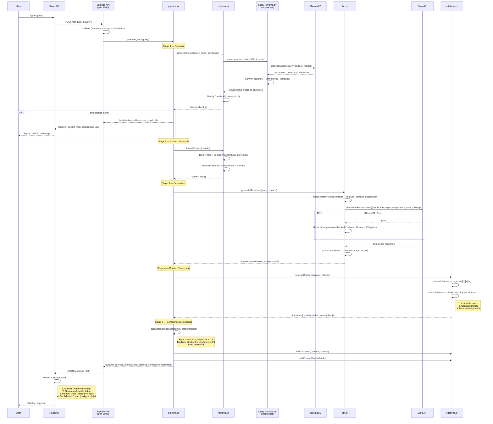

# Data Flow — End-to-End Query Processing

## Overview

This document traces a user query from the React frontend through all pipeline stages and back to the UI. Each stage transforms data in a specific way before passing it downstream.

## Sequence Diagram

## Timing Breakdown

| Stage | Typical Duration | Notes |
|-------|-----------------|-------|
| Retrieval (Python subprocess) | ~200ms | ChromaDB query + subprocess spawn overhead |
| Context Assembly | <1ms | String concatenation |
| LLM Generation (Groq) | ~800ms | Network latency + token generation |
| Citation Processing | <10ms | Regex + string matching |
| Confidence Calculation | <1ms | Arithmetic |
| **Total** | **~1.0–1.5s** | Average ~1.2s |

## Data Transformations by Stage

### Input → Stage 1 (Retrieval)
- **In**: Query string (e.g., `"What are Singapore import procedures?"`)
- **Out**: Array of chunk objects, each with `content`, `metadata` (13 fields), `distance`, `score`
- **Transform**: Query string → ChromaDB embedding → vector similarity search → distance-to-similarity conversion (`score = 1 - distance`) → threshold filter (score ≥ 0.15)

### Stage 1 → Stage 2 (Context Assembly)
- **In**: Filtered chunks array
- **Out**: Single context string
- **Transform**: Each chunk formatted as `[Title > Section]\ncontent\n\n`, concatenated up to `maxContextTokens × 4` character limit (default: 8000 chars)

### Stage 2 → Stage 3 (Generation)
- **In**: Query string + context string
- **Out**: LLM response object `{answer, finishReason, usage, model}`
- **Transform**: System prompt template with `{context}` placeholder replaced → two-message array (`[system, user]`) → Groq API call → parsed completion

### Stage 3 → Stage 4 (Citation Processing)
- **In**: Answer text + original chunks
- **Out**: `{citations[], markdown, stats}`
- **Transform**: Regex extraction of `[bracketed references]` → 3-tier matching to source chunks → enrichment with `sourceUrls`, `docId`, `score`

### Stage 4 → Stage 5 (Response Assembly)
- **In**: Answer, chunks, citation result
- **Out**: Complete API response
- **Transform**:
  - `buildSources()` — matched citations with external URLs → sources array
  - `buildRelatedDocs()` — unique parent documents from all chunks → relatedDocs array
  - `calculateConfidence()` — chunk count + average score → confidence level
  - Final assembly into `{answer, sources, relatedDocs, citations, confidence, metadata}`

## Error Flows

| Error | Source | Behavior |
|-------|--------|----------|
| ChromaDB unavailable | Python subprocess exit code ≠ 0 | Pipeline throws `Retrieval failed` error → 500 response |
| Groq 429 (rate limit) | Groq API | Retry with exponential backoff (base 1s, max 10s, 25% jitter), up to 3 attempts |
| Groq 5xx (server error) | Groq API | Same retry logic as 429 |
| Groq 400 (bad request) | Groq API | Immediate fail, no retry → Pipeline error → 500 response |
| Network errors (ECONNRESET, ETIMEDOUT) | Groq API | Retry with backoff |
| Empty query | Route validation | 400 response: `"Query cannot be empty"` |
| Query too long | Route validation | 400 response: `"Query exceeds maximum length of 1000 characters"` |
| No chunks found | Threshold filter returns 0 | `buildNoResultsResponse()` — skip LLM, return Low confidence with decline message |

## Related Documentation

- [System Overview](system_overview.md) — Component diagram and tech stack
- [RAG Pipeline Flow](rag_pipeline_flow.md) — Detailed stage configuration values
- See [services.md](../codebase/backend/services.md) for function-level details
