# Ingestion Pipeline Flow

## Overview

The ingestion pipeline transforms markdown documents from the knowledge base into vector embeddings stored in ChromaDB. It runs offline as a batch process — not during query time.

Entry point: `python scripts/ingest.py --clear`

## Pipeline Flow Diagram

```mermaid
flowchart LR
    subgraph "1. Discovery"
        KB["KB docs<br/>./kb/**/*.md"]
        Discover["discover_documents()"]
    end

    subgraph "2. Parsing"
        Parse["parse_document()"]
        FM["parse_frontmatter()"]
        Content["extract_content()"]
    end

    subgraph "3. Chunking"
        Chunk["chunk_document()"]
        Splitter["RecursiveCharacterTextSplitter<br/>size=600, overlap=90"]
        Headers["extract_section_header()<br/>extract_subsection_header()"]
    end

    subgraph "4. Embedding + Storage"
        ChromaAdd["collection.add()"]
        Embed["all-MiniLM-L6-v2<br/>(automatic via ChromaDB)"]
        ChromaDB[("ChromaDB<br/>PersistentClient<br/>./chroma_db")]
    end

    KB --> Discover
    Discover --> Parse
    Parse --> FM
    Parse --> Content
    FM --> Chunk
    Content --> Chunk
    Chunk --> Splitter
    Splitter --> Headers
    Headers --> ChromaAdd
    ChromaAdd --> Embed
    Embed --> ChromaDB
```



## Stage Details

### Stage 1: Discovery

**Function**: `process_docs.discover_documents(path)`

- Recursively finds all `.md` files under the KB root (`./kb/`)
- **Excludes** files in any `pdfs/` subdirectory — PDF extracts are reference material only; their content has been selectively merged into main documents
- Returns a sorted list of paths for consistent processing order

**Input**: `Path("./kb/")`
**Output**: `list[Path]` — 30 document paths

### Stage 2: Parsing

**Function**: `process_docs.parse_document(file_path)`

- Reads the markdown file (UTF-8)
- Extracts YAML frontmatter via `parse_frontmatter()` using the `python-frontmatter` library
- Extracts body content via `extract_content()` — **frontmatter is stripped**, only body text remains
- Derives `doc_id` from path: `{category_folder}_{filename_stem}`
- Derives `category` from the first folder in the relative path

**Output**: 13-field document dict:

| Field | Source | Example |
|-------|--------|---------|
| `doc_id` | Derived from path | `01_regulatory_sg_import_procedures` |
| `file_path` | Absolute resolved path | `C:\...\kb\01_regulatory\sg_import_procedures.md` |
| `title` | Frontmatter `title` | `"Singapore Import Procedures"` |
| `source_org` | Frontmatter `source_organization` | `"Singapore Customs"` |
| `source_urls` | Frontmatter `source_urls` (list) | `["https://www.customs.gov.sg/..."]` |
| `source_type` | Frontmatter `source_type` | `"public_regulatory"` |
| `last_updated` | Frontmatter `last_updated` | `"2025-01-15"` |
| `jurisdiction` | Frontmatter `jurisdiction` | `"SG"` |
| `category` | Derived from path | `"01_regulatory"` |
| `use_cases` | Frontmatter `use_cases` | `["UC-1.1", "UC-1.2"]` |
| `retrieval_keywords` | Frontmatter `retrieval_keywords` | `["import", "GST", "permit"]` |
| `content` | Body text (no frontmatter) | Full markdown content |
| `char_count` | `len(content)` | `4523` |

### Stage 3: Chunking

**Function**: `chunker.chunk_document(doc)`

- Uses `RecursiveCharacterTextSplitter` from `langchain-text-splitters`
- **Configuration**:
  - `chunk_size`: 600 characters (~150 tokens)
  - `chunk_overlap`: 90 characters (15%)
  - `separators`: `["\n## ", "\n### ", "\n\n", "\n"]`
  - `length_function`: `len` (character count)
- For each chunk, determines its position in the original document and extracts:
  - `section_header` — most recent `##` header above the chunk
  - `subsection_header` — most recent `###` header above the chunk
- Generates `chunk_id`: `{doc_id}_chunk_{index:03d}`

**Output**: List of chunk dicts inheriting all 13 document fields plus chunk-specific fields (`chunk_id`, `chunk_index`, `chunk_text`, `chunk_char_count`, `section_header`, `subsection_header`)

### Stage 4: Embedding and Storage

**Function**: `ingest.ingest_document(doc, collection)` → `collection.add()`

- ChromaDB's `DefaultEmbeddingFunction` automatically generates embeddings using **all-MiniLM-L6-v2 via ONNX** (384 dimensions)
- There is no separate embedding step — `collection.add()` handles embedding internally
- 13 metadata fields are stored per chunk in ChromaDB:

| Metadata Field | Type | Source |
|----------------|------|--------|
| `doc_id` | string | Document ID |
| `title` | string | Document title |
| `source_org` | string | Source organization |
| `source_type` | string | Document type enum |
| `jurisdiction` | string | Jurisdiction code |
| `category` | string | Category folder name |
| `section_header` | string | `##` header above chunk |
| `subsection_header` | string | `###` header above chunk |
| `chunk_index` | int | Zero-based chunk position |
| `file_path` | string | Absolute file path |
| `source_urls` | string | Comma-joined URL list |
| `retrieval_keywords` | string | Comma-joined keyword list |
| `use_cases` | string | Comma-joined use case IDs |

Note: List fields (`source_urls`, `retrieval_keywords`, `use_cases`) are comma-joined into strings because ChromaDB metadata only supports scalar types.

## Key Parameters

| Parameter | Value | Rationale |
|-----------|-------|-----------|
| CHUNK_SIZE | 600 chars | Optimal for this KB (tested 400, 600, 800, 1000 — 600 balances precision and context) |
| CHUNK_OVERLAP | 90 chars (15%) | Prevents information loss at chunk boundaries |
| Separators | `## → ### → \n\n → \n` | Preserves semantic structure (section > subsection > paragraph > line) |
| Collection | `waypoint_kb` | Single collection for all documents |
| Embedding | all-MiniLM-L6-v2 | ChromaDB default — no API key, no GPU required |

## Critical Design Decision

**Frontmatter is stripped before embedding.** The `extract_content()` function removes YAML frontmatter, so only body text is embedded in ChromaDB. This means:

- `retrieval_keywords` in frontmatter have **no direct impact** on retrieval
- Key terms and abbreviations must appear in the document body text to be discoverable
- This was a deliberate finding from Week 3 optimization — adding "Key Terms" body sections improved retrieval hit rate significantly

## KB Statistics

| Metric | Value |
|--------|-------|
| Documents | 30 |
| Total chunks | 709 |
| Avg chunks/doc | ~23.6 |
| Retrieval hit rate | 92% (50-query test suite) |

## CLI Usage

```bash
# Full ingestion (clear and rebuild)
python scripts/ingest.py --clear

# Dry run (process without storing)
python scripts/ingest.py --dry-run

# Verbose (show chunk details)
python scripts/ingest.py --verbose

# Single category
python scripts/ingest.py --category 01_regulatory

# Verify after ingestion
python scripts/verify_ingestion.py
```

## Related Documentation

- [KB Schema](kb_schema.md) — Frontmatter fields, category structure, how to add documents
- [System Overview](system_overview.md) — Component diagram and tech stack
- See [ingestion.md](../codebase/scripts/ingestion.md) for function-level details
