# RAG Pipeline Flow

## Overview

The RAG pipeline processes user queries through five sequential stages: retrieval, context assembly, generation, citation processing, and confidence scoring. The orchestrator is `pipeline.js:processQuery()`.

## Pipeline Flow Diagram

```mermaid
flowchart TB
    Start["POST /api/query<br/>{query: string}"]
    Validate["Validate input<br/>(non-empty, string, ≤1000 chars)"]

    subgraph "Stage 1: Retrieval"
        Retrieve["retrieveChunks(query, {topK, threshold})"]
        Spawn["Spawn Python subprocess"]
        QueryChroma["query_chroma.py<br/>Read JSON from stdin"]
        ChromaQuery["ChromaDB.query()<br/>n_results = topK"]
        Convert["distance → similarity<br/>score = 1 - distance"]
        Filter["filterByThreshold()<br/>score ≥ threshold"]
    end

    subgraph "Stage 2: Context Assembly"
        Format["formatContext(chunks)"]
        Build["Build per chunk:<br/>[Title > Section]\\ncontent\\n\\n"]
        Truncate["Truncate at maxContextTokens × 4 chars"]
    end

    subgraph "Stage 3: Generation"
        Generate["generateResponse(query, context)"]
        SysPrompt["buildSystemPrompt(context)<br/>Replace {context} in template"]
        GroqCall["Groq API<br/>chat.completions.create()"]
        ParseComp["parseCompletion()<br/>→ {answer, usage, model}"]
    end

    subgraph "Stage 4: Citation Processing"
        Process["processCitations(answer, chunks)"]
        Extract["extractCitations()<br/>regex: /\\[([^\\]]+)\\]/g"]
        Enrich["enrichCitations()<br/>3-tier matching"]
        BuildSrc["buildSources() + buildRelatedDocs()"]
    end

    subgraph "Stage 5: Confidence"
        Confidence["calculateConfidence(chunks, citationResult)"]
    end

    NoResults["buildNoResultsResponse()<br/>Skip LLM, return Low confidence"]
    Response["{answer, sources, relatedDocs,<br/>citations, confidence, metadata}"]

    Start --> Validate
    Validate --> Retrieve
    Retrieve --> Spawn
    Spawn --> QueryChroma
    QueryChroma --> ChromaQuery
    ChromaQuery --> Convert
    Convert --> Filter

    Filter -->|"0 chunks"| NoResults
    Filter -->|"≥1 chunks"| Format

    Format --> Build
    Build --> Truncate
    Truncate --> Generate
    Generate --> SysPrompt
    SysPrompt --> GroqCall
    GroqCall --> ParseComp
    ParseComp --> Process
    Process --> Extract
    Extract --> Enrich
    Enrich --> BuildSrc
    BuildSrc --> Confidence
    Confidence --> Response
    NoResults --> Response
```

## Stage Configuration

### Stage 1: Retrieval

| Parameter | Value | Source |
|-----------|-------|--------|
| `topK` | 10 | `config.retrievalTopK` (env: `RETRIEVAL_TOP_K`) |
| `threshold` | 0.15 | `config.relevanceThreshold` (env: `RELEVANCE_THRESHOLD`) |
| Python script | `scripts/query_chroma.py` | Spawned as subprocess |
| Communication | JSON via stdin/stdout | `proc.stdin.write(JSON)` → `JSON.parse(stdout)` |
| Score conversion | `score = 1 - distance` | ChromaDB returns L2 distance, converted to similarity |

**Process**:
1. `retrieveChunks()` calls `executePythonQuery()` with `{query, top_k, collection_name}`
2. Python subprocess spawns, reads JSON from stdin
3. `query_chroma.py` opens ChromaDB PersistentClient, queries collection
4. Returns chunks with `content`, `metadata`, `distance`, `score` via JSON stdout
5. `filterByThreshold()` removes chunks with score < 0.15

### Stage 2: Context Assembly

| Parameter | Value | Source |
|-----------|-------|--------|
| `maxContextTokens` | 2000 | `config.maxContextTokens` (env: `MAX_CONTEXT_TOKENS`) |
| Max chars | 8000 | `maxContextTokens × 4` (approximate chars-to-tokens ratio) |
| Format | `[Title > Section]\ncontent\n\n` | Per chunk, with optional section header |

**Process**:
1. `formatContext()` iterates chunks in order (highest similarity first)
2. Each chunk formatted as `[{title} > {section}]\n{content}\n\n`
3. If no section header, format is `[{title}]\n{content}\n\n`
4. Truncates when accumulated character count exceeds `maxContextTokens × 4`

### Stage 3: Generation

| Parameter | Value | Source |
|-----------|-------|--------|
| Model | `llama-3.1-8b-instant` | `config.llmModel` (env: `LLM_MODEL`) |
| Temperature | 0.3 | `config.llmTemperature` (env: `LLM_TEMPERATURE`) |
| Max tokens | 500 | `config.llmMaxTokens` (env: `LLM_MAX_TOKENS`) |
| Base URL | `https://api.groq.com/openai/v1` | `config.llmBaseUrl` (env: `LLM_BASE_URL`) |
| API key | Required (env var) | `config.llmApiKey` (env: `LLM_API_KEY`) |
| Max retries | 3 | Hardcoded default |
| Backoff base | 1000ms (1s) | Exponential: 1s, 2s, 4s... |
| Backoff max | 10000ms (10s) | Cap on delay |
| Backoff jitter | 25% | Random 0–25% of computed delay |

**Process**:
1. `generateResponse()` initializes OpenAI-compatible client (singleton) pointing at Groq
2. `buildSystemPrompt()` loads `prompts/system.txt` template and replaces `{context}` placeholder
3. Sends two messages: `[{role: system, content: systemPrompt}, {role: user, content: query}]`
4. On 429/5xx/network errors: retry with exponential backoff + jitter
5. On 400 errors: immediate fail (not retryable)
6. `parseCompletion()` extracts answer text, finish reason, and token usage

### Stage 4: Citation Processing

| Parameter | Value | Source |
|-----------|-------|--------|
| Extraction pattern | `/\[([^\]]+)\]/g` | Regex for `[bracketed text]` |
| Match tier 1 | Exact title match | `chunk.title === citation.title` (case-insensitive) |
| Match tier 2 | Contains match | `chunkTitle.includes(citationTitle)` or reverse |
| Match tier 3 | Dice similarity | `similarity() > 0.5` (lowered from 0.7 for better recall) |
| Deduplication | By title | `seenTitles` Set prevents duplicates |

**Process**:
1. `extractCitations()` — regex finds all `[Title]` or `[Title > Section]` patterns, deduplicates by title
2. `enrichCitations()` — for each citation, tries 3-tier matching against chunk metadata to find source
3. Matched citations get `sourceUrls`, `docId`, `score` from the chunk
4. Unmatched citations get `matched: false`, empty arrays
5. `buildSources()` — extracts external URLs from matched citations, deduplicates by URL
6. `buildRelatedDocs()` — extracts unique parent documents from all retrieved chunks (not just cited ones), maps category folder names to frontend labels via `CATEGORY_MAP`

### Stage 5: Confidence Scoring

| Level | Criteria | Example Reason |
|-------|----------|----------------|
| **High** | ≥3 chunks AND avgScore ≥ 0.5 | `"7 relevant sources with 3 citations"` |
| **Medium** | ≥2 chunks AND avgScore ≥ 0.3 | `"4 sources found, average relevance 42%"` |
| **Low** | Everything else | `"Only 1 source found"` or `"Low relevance scores (avg 22%)"` |

Note: Thresholds were lowered during Phase 3 fix loop (High: 0.6→0.5, Medium: 0.4→0.3) because no queries achieved High confidence with the original thresholds.

## No-Results Path

When `filterByThreshold()` returns 0 chunks:
1. `buildNoResultsResponse()` is called immediately
2. LLM call is **skipped** (saves cost and latency)
3. Returns: `{answer: "I don't have specific information...", confidence: {level: "Low"}, sources: [], relatedDocs: [], metadata: {chunksRetrieved: 0, model: null}}`

## Related Documentation

- [Data Flow](data_flow.md) — Sequence diagram and timing breakdown
- [System Overview](system_overview.md) — Component diagram
- See [services.md](../codebase/backend/services.md) for function-level details
- See [config.md](../codebase/backend/config.md) for all configuration values
