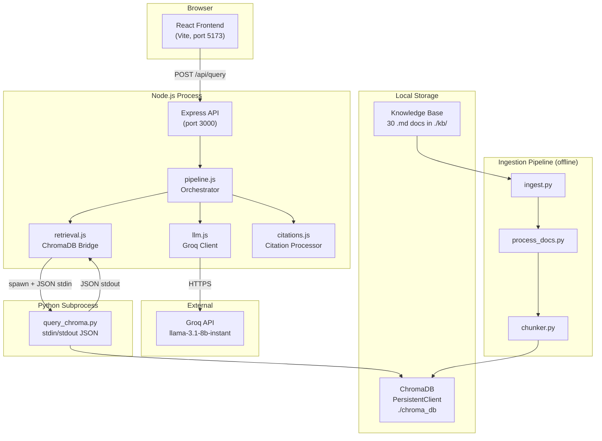

# System Overview — Waypoint RAG Co-Pilot

## Purpose

Waypoint is a Retrieval-Augmented Generation (RAG) co-pilot for freight forwarding customer service agents. It helps agents at a Singapore-based 3PL company answer questions about shipment booking procedures, customs regulations, carrier services, and company policies.

The system retrieves relevant information from a curated knowledge base of 30 markdown documents covering Singapore and Southeast Asian freight forwarding topics, then uses a large language model to generate cited, structured answers.

## Tech Stack

| Component | Technology | Version | Notes |
|-----------|------------|---------|-------|
| Vector Database | ChromaDB | 0.5.23 | Local PersistentClient, `./chroma_db` |
| Embeddings | all-MiniLM-L6-v2 | via ONNX | 384-dimensional, ChromaDB default |
| Document Processing | Python | 3.11+ | Ingestion, chunking, ChromaDB queries |
| Backend API | Express (Node.js) | 18+ | REST API on port 3000 |
| Frontend | React + Tailwind CSS | React 18+ | Vite dev server on port 5173 |
| LLM | Groq API (Llama 3.1 8B) | llama-3.1-8b-instant | OpenAI-compatible API |
| Text Splitting | langchain-text-splitters | — | RecursiveCharacterTextSplitter |
| Markdown Rendering | react-markdown + remark-gfm | — | Frontend answer display |

## Component Diagram

## Deployment Topology

All components run locally on a single machine except the LLM API:

| Component | Location | Port/Path |
|-----------|----------|-----------|
| React Frontend | Local (Vite dev server) | `localhost:5173` |
| Express API | Local (Node.js) | `localhost:3000` |
| Python Subprocess | Local (spawned per query) | stdin/stdout |
| ChromaDB | Local (file-based) | `./chroma_db/` |
| Knowledge Base | Local (markdown files) | `./kb/` |
| Groq API | External (cloud) | `https://api.groq.com/openai/v1` |

There is no containerization, load balancing, or multi-instance deployment — this is a single-user POC.

## Key Constraints

- **No live system integration**: The POC does not connect to any TMS, WMS, or operational systems. All data comes from the static knowledge base.
- **No real-time data**: No live tracking, rate quotes, or booking modifications. The system redirects these requests to appropriate contacts.
- **Singapore-centric**: Regulatory content focuses on Singapore Customs with secondary coverage of ASEAN trade agreements.
- **Single LLM dependency**: Groq API is the only external service. If unavailable, the pipeline fails (with retry logic for transient errors).
- **Knowledge-only assistant**: The system provides information but cannot execute actions (book, cancel, track shipments).
- **POC cost constraint**: LLM API costs capped at $10 total across the POC lifecycle.

## Related Documentation

- [Data Flow](data_flow.md) — End-to-end query flow with sequence diagram
- [RAG Pipeline Flow](rag_pipeline_flow.md) — Detailed pipeline stages and configuration
- [Ingestion Pipeline Flow](ingestion_pipeline_flow.md) — Document processing and chunking
- [KB Schema](kb_schema.md) — Knowledge base structure and metadata
- [API Contract](api_contract.md) — REST API specification
- See [services.md](../codebase/backend/services.md) for function-level details
