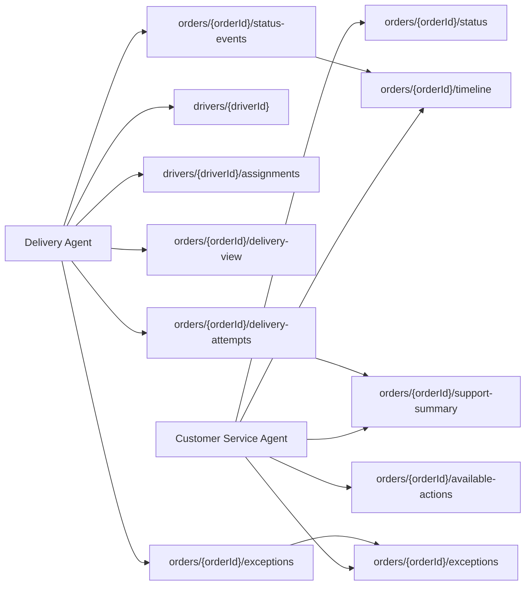

# Partner Source Use Case Resource Map

## 1. Purpose

This document maps the agreed `partner-source` use cases to the correct API resources.

The purpose is to avoid designing endpoints directly from user stories. We first identify the resources that the API should expose, then map each actor use case to those resources.

This document is a planning artifact. It is not the final OpenAPI contract yet.

Current Slice 1 status:

```text
The frozen Slice 1 contract includes only orders, drivers, assignments, status-events, health, and ready.
Resources such as delivery-attempts, exceptions, support-summary, delivery-view, customer-actions, notes, and public assignment creation are Slice 2/later unless the design freeze is deliberately reopened.
```

## 2. Design Rule

Use resources, not actions, as the foundation of the API.

Good:

```http
POST /api/v1/orders/{orderId}/status-events
```

Avoid:

```http
POST /api/v1/orders/{orderId}/update-status
```

Reason:

- a delivery agent is creating an operational event
- the event becomes part of the order timeline
- customer service can later read the event
- the current status can be derived or synchronized from the latest valid event

## 3. Actor Resource Flow



## 4. Resource Inventory

| Resource | Type | Primary Actor | Purpose |
|---|---|---|---|
| `orders` | Core resource | Customer Service Agent, Delivery Agent | Represents the delivery order known to the partner source. |
| `drivers` | Core resource | Delivery Agent | Represents a seeded delivery driver. |
| `assignments` | Core relationship resource | Delivery Agent | Links drivers to orders. |
| `status-events` | Core event resource | Delivery Agent | Records operational status changes over time. |
| `delivery-attempts` | Core event/detail resource | Delivery Agent, Customer Service Agent | Records failed or completed delivery attempt details. |
| `exceptions` | Core event/detail resource | Delivery Agent, Customer Service Agent | Records delays, address issues, customs holds, damage flags, or no-update reasons. |
| `customer-actions` | Derived facts/read model | Customer Service Agent | Describes what actions are allowed or blocked for the customer. |
| `support-summary` | Read model | Customer Service Agent, BFF | Aggregates customer-safe support facts for one order. |
| `delivery-view` | Read model | Delivery Agent | Aggregates the details a driver needs to perform delivery. |
| `health` / `ready` | Platform resource | System | Reports service health and readiness. |

## 5. Resource: `orders`

### What It Is

`orders` is the main delivery record.

It represents a package or delivery order that the logistics partner knows about. In this prototype, orders are synthetic records seeded into the database.

The order should contain stable facts:

- `orderId`
- current status
- recipient display name
- delivery address or address summary
- current ETA
- delivery window
- latest known location snapshot
- assigned driver reference, if assigned
- timestamps

### What It Should Not Do

The `orders` resource should not become a giant endpoint that returns everything. It should expose focused subresources for status, timeline, support summary, exceptions, and delivery views.

### Use Cases Mapped To `orders`

| Use Case | Actor | Resource Role | Candidate Endpoint |
|---|---|---|---|
| `CSA-01` Look up order by order ID | Customer Service Agent | Confirms order existence and base status. | `GET /api/v1/orders/{orderId}/status` |
| `CSA-02` View current order status | Customer Service Agent | Reads current operational state. | `GET /api/v1/orders/{orderId}/status` |
| `CSA-04` View ETA and delivery window | Customer Service Agent | Reads ETA fields on the order/status response. | `GET /api/v1/orders/{orderId}/status` |
| `DA-03` View delivery details | Delivery Agent | Reads driver-specific order detail. | `GET /api/v1/orders/{orderId}/delivery-view` |

### Notes For OpenAPI Design

`orders` should have reusable schemas:

- `OrderStatusResponse`
- `DeliveryWindow`
- `LocationSnapshot`
- `AssignedDriverSummary`
- `DeliveryViewResponse`

## 6. Resource: `drivers`

### What It Is

`drivers` represents delivery agents who can be assigned to orders.

For the MVP, this is not a full identity provider. It is a seeded driver profile used by the driver frontend and demo login flow.

Driver facts may include:

- `driverId`
- display name
- availability status
- phone or contact placeholder, if needed
- active assignment count

### What It Should Not Do

The driver resource should not implement full authentication, payroll, scheduling, route optimization, or real workforce management.

### Use Cases Mapped To `drivers`

| Use Case | Actor | Resource Role | Candidate Endpoint |
|---|---|---|---|
| `DA-01` Demo login as driver | Delivery Agent | Confirms seeded driver exists. | `GET /api/v1/drivers/{driverId}` |
| `DA-02` Retrieve assigned orders | Delivery Agent | Parent resource for driver assignments. | `GET /api/v1/drivers/{driverId}/assignments` |

### Notes For OpenAPI Design

`drivers` should have reusable schemas:

- `DriverResponse`
- `DriverSummary`
- `DriverAvailabilityStatus`

## 7. Resource: `assignments`

### What It Is

`assignments` links a driver to one or more delivery orders.

This resource answers:

- which orders belong to this driver
- which driver is assigned to this order
- whether the assignment is active, completed, or cancelled

### What It Should Not Do

Assignments should not handle route optimization or driver scheduling. For the MVP, assignments are seeded or created through a simple administrative/demo path.

### Use Cases Mapped To `assignments`

| Use Case | Actor | Resource Role | Candidate Endpoint |
|---|---|---|---|
| `DA-02` Retrieve assigned orders | Delivery Agent | Lists active orders assigned to driver. | `GET /api/v1/drivers/{driverId}/assignments` |
| `DA-03` View delivery details | Delivery Agent | Assignment response can include lightweight order details. | `GET /api/v1/drivers/{driverId}/assignments` |
| Admin/demo assign order to driver | System or seed process | Creates a driver-order link. | `POST /api/v1/orders/{orderId}/assignments` |

### Notes For OpenAPI Design

The first API can avoid a standalone `GET /assignments/{assignmentId}` unless the frontend truly needs it.

Use pagination from the beginning:

```http
GET /api/v1/drivers/{driverId}/assignments?page=1&pageSize=20
```

Reusable schemas:

- `DriverAssignmentResponse`
- `DriverAssignmentItem`
- `AssignmentStatus`
- `PagedDriverAssignmentsResponse`

## 8. Resource: `status-events`

### What It Is

`status-events` is the append-only history of what happened to an order.

This is the most important write resource for the delivery agent.

Examples:

- picked up
- in transit
- out for delivery
- delivered
- delivery attempted
- delayed

### What It Should Not Do

Status events should not be overwritten casually. If a driver reports a new status, create a new event. The system can update the order's current status after validating the transition.

### Use Cases Mapped To `status-events`

| Use Case | Actor | Resource Role | Candidate Endpoint |
|---|---|---|---|
| `CSA-03` View order timeline | Customer Service Agent | Reads status event history. | `GET /api/v1/orders/{orderId}/timeline` |
| `DA-04` Mark order as picked up | Delivery Agent | Creates a `PICKED_UP` event. | `POST /api/v1/orders/{orderId}/status-events` |
| `DA-05` Mark order as out for delivery | Delivery Agent | Creates an `OUT_FOR_DELIVERY` event. | `POST /api/v1/orders/{orderId}/status-events` |
| `DA-06` Mark order as delivered | Delivery Agent | Creates a `DELIVERED` event. | `POST /api/v1/orders/{orderId}/status-events` |

### Notes For OpenAPI Design

The write endpoint must validate:

- order exists
- driver exists
- driver is assigned to the order
- status is recognized
- status transition is allowed
- required fields for that status are present

Likely error responses:

- `404 ORDER_NOT_FOUND`
- `404 DRIVER_NOT_FOUND`
- `403 ORDER_NOT_ASSIGNED_TO_DRIVER`
- `409 INVALID_STATUS_TRANSITION`
- `422 INVALID_STATUS_EVENT`

Reusable schemas:

- `CreateStatusEventRequest`
- `StatusEventResponse`
- `OrderTimelineResponse`
- `OrderStatus`

## 9. Resource: `delivery-attempts`

### What It Is

`delivery-attempts` records what happened when a driver attempted delivery.

This resource is needed for realistic missed-delivery support cases.

Examples:

- recipient unavailable
- address inaccessible
- customer refused delivery
- business closed

### What It Should Not Do

This resource should not become a full redelivery scheduling system. For the MVP, it can store the attempt result and optionally a next attempt timestamp.

### Use Cases Mapped To `delivery-attempts`

| Use Case | Actor | Resource Role | Candidate Endpoint |
|---|---|---|---|
| `DA-07` Report failed delivery attempt | Delivery Agent | Creates a failed attempt record. | `POST /api/v1/orders/{orderId}/delivery-attempts` |
| `CSA-06` View failed delivery attempt details | Customer Service Agent | Reads latest attempt details through support summary. | `GET /api/v1/orders/{orderId}/support-summary` |

### Notes For OpenAPI Design

The first implementation can make `delivery-attempts` create both:

- a delivery attempt record
- a `DELIVERY_ATTEMPTED` status event

That keeps the timeline and support summary aligned.

Reusable schemas:

- `CreateDeliveryAttemptRequest`
- `DeliveryAttemptResponse`
- `DeliveryAttemptReasonCode`

## 10. Resource: `exceptions`

### What It Is

`exceptions` records abnormal delivery conditions.

Examples:

- weather delay
- operational backlog
- customs hold
- address issue
- no recent scan
- damaged package reported

### What It Should Not Do

Exceptions should not implement full claims, customs payment, refund, or investigation workflows. Those can be represented as static flags or deferred fields.

### Use Cases Mapped To `exceptions`

| Use Case | Actor | Resource Role | Candidate Endpoint |
|---|---|---|---|
| `CSA-05` View delay or exception reason | Customer Service Agent | Reads exception facts. | `GET /api/v1/orders/{orderId}/exceptions` |
| `DA-08` Report operational exception | Delivery Agent | Creates an exception record. | `POST /api/v1/orders/{orderId}/exceptions` |
| `CSA-09` Get support summary | Customer Service Agent | Includes latest exception summary. | `GET /api/v1/orders/{orderId}/support-summary` |

### Notes For OpenAPI Design

`exceptions` should be small and enum-driven in the MVP.

Reusable schemas:

- `OrderExceptionResponse`
- `CreateOrderExceptionRequest`
- `ExceptionCode`

## 11. Resource: `customer-actions`

### What It Is

`customer-actions` is a read model that describes what the customer can or cannot do for a specific order.

Examples:

- add delivery instructions
- request hold
- change address
- reschedule delivery

### What It Should Not Do

For the MVP, this resource should not execute the action. It only reports whether the action is allowed or blocked.

Example:

```json
{
  "allowedCustomerActions": [
    "ADD_DELIVERY_INSTRUCTIONS"
  ],
  "blockedCustomerActions": [
    {
      "action": "CHANGE_ADDRESS",
      "reason": "SHIPMENT_ALREADY_OUT_FOR_DELIVERY"
    }
  ]
}
```

### Use Cases Mapped To `customer-actions`

| Use Case | Actor | Resource Role | Candidate Endpoint |
|---|---|---|---|
| `CSA-08` View available customer actions | Customer Service Agent | Reads allowed/blocked customer actions. | `GET /api/v1/orders/{orderId}/available-actions` |
| `CSA-09` Get support summary | Customer Service Agent | May include a compact action summary. | `GET /api/v1/orders/{orderId}/support-summary` |

### Notes For OpenAPI Design

This can be deferred until the main status and driver update loop works.

Reusable schemas:

- `AvailableActionsResponse`
- `AllowedCustomerAction`
- `BlockedCustomerAction`

## 12. Resource: `support-summary`

### What It Is

`support-summary` is a read model for the customer service agent and BFF.

It is not a separate operational table at first. It can be assembled from:

- order
- latest status event
- timeline summary
- assignment
- latest delivery attempt
- latest exception
- available customer actions

### What It Should Not Do

`support-summary` should not generate chatbot wording. It should return structured facts and message codes. The BFF or chatbot layer decides final wording.

### Use Cases Mapped To `support-summary`

| Use Case | Actor | Resource Role | Candidate Endpoint |
|---|---|---|---|
| `CSA-06` View failed delivery attempt details | Customer Service Agent | Shows missed delivery context. | `GET /api/v1/orders/{orderId}/support-summary` |
| `CSA-07` View delivered but not found support facts | Customer Service Agent | Shows delivery note and proof flag. | `GET /api/v1/orders/{orderId}/support-summary` |
| `CSA-09` Get support summary | Customer Service Agent | Main aggregated support view. | `GET /api/v1/orders/{orderId}/support-summary` |

### Notes For OpenAPI Design

This endpoint is useful for the BFF because it reduces multiple service calls.

However, it should still expose structured fields:

- `currentStatus`
- `estimatedDeliveryAt`
- `latestEvent`
- `latestException`
- `latestDeliveryAttempt`
- `deliveryNote`
- `customerSafeMessageCode`
- `allowedCustomerActions`

Reusable schemas:

- `SupportSummaryResponse`
- `LatestEventSummary`
- `LatestExceptionSummary`
- `LatestDeliveryAttemptSummary`

## 13. Resource: `delivery-view`

### What It Is

`delivery-view` is a read model for the delivery agent frontend.

It gives the driver the information needed to perform the assigned delivery.

Likely fields:

- `orderId`
- current status
- delivery address
- recipient display name
- delivery window
- simple delivery instructions
- assignment status
- available driver actions

### What It Should Not Do

This view should not expose customer service notes, chatbot details, claims details, or internal support-only information.

### Use Cases Mapped To `delivery-view`

| Use Case | Actor | Resource Role | Candidate Endpoint |
|---|---|---|---|
| `DA-03` View delivery details | Delivery Agent | Shows driver-safe order details. | `GET /api/v1/orders/{orderId}/delivery-view` |
| `DA-05` Mark out for delivery | Delivery Agent | Shows whether this action is available. | `GET /api/v1/orders/{orderId}/delivery-view` |
| `DA-06` Mark delivered | Delivery Agent | Shows whether this action is available. | `GET /api/v1/orders/{orderId}/delivery-view` |
| `DA-07` Report failed delivery attempt | Delivery Agent | Shows failed-attempt action availability. | `GET /api/v1/orders/{orderId}/delivery-view` |

### Notes For OpenAPI Design

This can be included in `GET /drivers/{driverId}/assignments` first if we want fewer endpoints.

Recommended MVP choice:

- include lightweight delivery details in assignments
- add `delivery-view` only if the driver frontend needs a separate detail screen

Reusable schemas:

- `DeliveryViewResponse`
- `DriverActionAvailability`

## 14. Resource: `health` And `ready`

### What It Is

`health` and `ready` are operational endpoints.

They help local development, tests, and CI know whether the service is running and ready to serve requests.

### Use Cases Mapped To `health` And `ready`

| Use Case | Actor | Resource Role | Candidate Endpoint |
|---|---|---|---|
| Service liveness check | System | Confirms process is running. | `GET /health` |
| Service readiness check | System | Confirms dependencies are ready. | `GET /ready` |

### Notes For OpenAPI Design

These do not need to live under `/api/v1`.

## 15. Use Case To Resource Matrix

| Use Case | Actor | Main Resource | Secondary Resources | API Style |
|---|---|---|---|---|
| `CSA-01` Look up order by order ID | Customer Service Agent | `orders` | None | Read |
| `CSA-02` View current order status | Customer Service Agent | `orders` | `assignments`, `drivers` | Read |
| `CSA-03` View order timeline | Customer Service Agent | `status-events` | `orders` | Read |
| `CSA-04` View ETA and delivery window | Customer Service Agent | `orders` | None | Read |
| `CSA-05` View delay or exception reason | Customer Service Agent | `exceptions` | `orders` | Read |
| `CSA-06` View failed delivery attempt details | Customer Service Agent | `delivery-attempts` | `support-summary`, `orders` | Read |
| `CSA-07` View delivered but not found facts | Customer Service Agent | `support-summary` | `status-events`, `orders` | Read |
| `CSA-08` View available customer actions | Customer Service Agent | `customer-actions` | `orders` | Read |
| `CSA-09` Get support summary | Customer Service Agent | `support-summary` | `orders`, `status-events`, `exceptions`, `delivery-attempts`, `assignments` | Derived read |
| `DA-01` Demo login as driver | Delivery Agent | `drivers` | None | Read |
| `DA-02` Retrieve assigned orders | Delivery Agent | `assignments` | `drivers`, `orders` | Read |
| `DA-03` View delivery details | Delivery Agent | `delivery-view` | `orders`, `assignments` | Derived read |
| `DA-04` Mark order as picked up | Delivery Agent | `status-events` | `orders`, `assignments` | Write |
| `DA-05` Mark order as out for delivery | Delivery Agent | `status-events` | `orders`, `assignments` | Write |
| `DA-06` Mark order as delivered | Delivery Agent | `status-events` | `orders`, `assignments` | Write |
| `DA-07` Report failed delivery attempt | Delivery Agent | `delivery-attempts` | `status-events`, `orders`, `assignments` | Write |
| `DA-08` Report operational exception | Delivery Agent | `exceptions` | `orders`, `assignments`, `status-events` | Write |
| `DA-09` Add delivery note | Delivery Agent | `status-events` or `order-notes` | `orders` | Write |

## 16. Candidate Endpoint Set

### First Slice

These are enough to prove the core loop.

```http
GET /api/v1/orders/{orderId}/status
GET /api/v1/orders/{orderId}/timeline
GET /api/v1/drivers/{driverId}
GET /api/v1/drivers/{driverId}/assignments
POST /api/v1/orders/{orderId}/status-events
GET /health
GET /ready
```

### Second Slice

These add more realistic customer-service support.

```http
GET /api/v1/orders/{orderId}/support-summary
GET /api/v1/orders/{orderId}/exceptions
POST /api/v1/orders/{orderId}/delivery-attempts
```

### Later

These are useful, but should not block the MVP.

```http
GET /api/v1/orders/{orderId}/available-actions
GET /api/v1/orders/{orderId}/delivery-view
POST /api/v1/orders/{orderId}/exceptions
POST /api/v1/orders/{orderId}/notes
POST /api/v1/orders/{orderId}/assignments
```

## 17. Resource Ownership Rules

| Rule | Decision |
|---|---|
| Status changes | Create `status-events`; do not directly expose a generic update-status command. |
| Timeline | Read from `status-events`. |
| Current status | Store on `orders` for easy reads, but update only after valid status event creation. |
| Driver work list | Read from `assignments`. |
| Failed delivery | Create `delivery-attempts`; also reflect in order status/timeline. |
| Delay or abnormal issue | Create/read through `exceptions`. |
| Support view | Use `support-summary` as a derived read model. |
| Driver detail view | Use `delivery-view` only if assignment response is not enough. |
| Customer actions | Start read-only; do not execute address changes or rescheduling in MVP. |

## 18. Open Questions For Review

1. Should `delivery-view` be a separate endpoint, or should the assignments response include enough delivery details for the first driver frontend?
2. Should `POST /api/v1/orders/{orderId}/assignments` be part of the public partner-source API, or only a seed/admin operation?
3. Should `delivery-attempts` automatically create a `DELIVERY_ATTEMPTED` status event?
4. Should `exceptions` be writable by drivers in the MVP, or seeded/read-only until the core status update loop works?
5. Should `support-summary` include `available-actions`, or should that remain a separate call?

## 19. Recommendation

Use this map to update the API contract next.

The first OpenAPI design should focus on:

- `orders`
- `drivers`
- `assignments`
- `status-events`

Then add:

- `delivery-attempts`
- `exceptions`
- `support-summary`

This keeps the first API realistic, testable, and small enough for a solo developer to implement.
