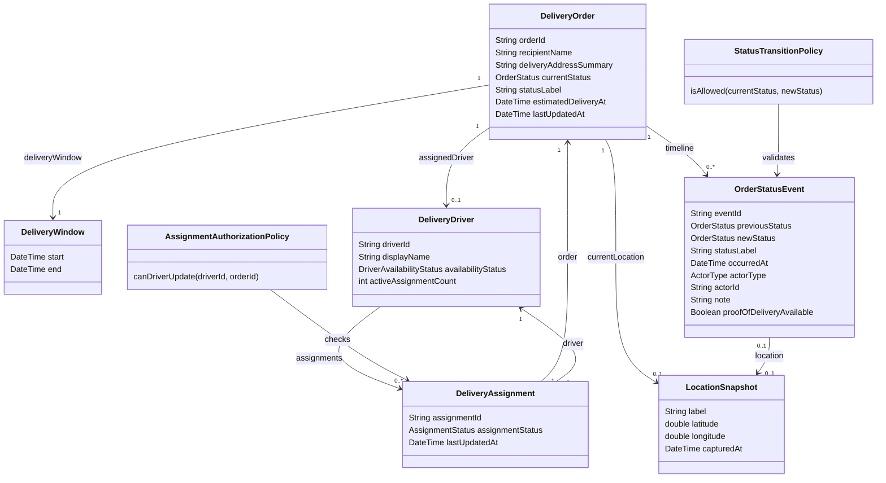

# Partner Source Domain Model

## 1. Purpose

This document defines the Slice 1 domain model for `partner-source`.

This is a design artifact, not an implementation scaffold. It describes the business objects, relationships, validation policies, and API model ownership needed to support the first partner-source API contract.

The model should stay aligned with:

- [../research/use-cases.md](../research/use-cases.md)
- [../research/use-case-resource-map.md](../research/use-case-resource-map.md)
- [../archive/audits/api-design-verification-report.md](../archive/audits/api-design-verification-report.md)
- [../contracts/openapi/partner-source.v1.yaml](../contracts/openapi/partner-source.v1.yaml)

## 2. Design Approach

The class diagram should not start from generic logistics nouns. It should start from the use cases and the API contract.

Use this sequence:

```text
actor question/action
-> information needed to answer or perform it
-> required API fields
-> domain class that owns those fields
-> domain rules that protect valid behavior
-> seed scenario and test case that prove the behavior
```

This prevents the class diagram from becoming either too thin or too speculative.

## 3. Class Inclusion Rule

A class earns its place only if it supports at least one of these:

| Reason | Example |
|---|---|
| API response | `DeliveryOrder` owns `currentStatus`, `estimatedDeliveryAt`, and `lastUpdatedAt` for `GET /orders/{orderId}/status`. |
| API request | `OrderStatusEvent` is created by `POST /orders/{orderId}/status-events`. |
| Validation rule | `StatusTransitionPolicy` decides whether an event can move an order from one status to another. |
| Relationship rule | `DeliveryAssignment` proves that a driver is allowed to update an order. |
| Seed-data scenario | `DeliveryDriver` and `DeliveryAssignment` are needed to test assigned and unassigned driver cases. |
| Future extension point | `DeliveryWindow` is simple now, but keeps ETA and arrival windows explicit for driver and support use cases. |

If a class does not support one of these reasons, it should not be in Slice 1.

## 4. Slice 1 Scope

Slice 1 must prove the core operational loop:

```text
delivery agent retrieves assigned orders
-> delivery agent creates a status event
-> customer service reads updated status and timeline
```

### Included In Slice 1

- orders
- drivers
- assignments
- status events
- current location snapshots
- delivery windows
- status transition validation
- assignment authorization validation

### Deferred From Slice 1

- delivery attempts
- exceptions
- support summaries
- customer action availability
- full route optimization
- authentication provider integration
- claims, refunds, customs, or payment workflows

## 5. Domain Class Diagram



## 6. Class Responsibilities

| Class | Responsibility | Why It Exists |
|---|---|---|
| `DeliveryOrder` | Owns stable order facts and the current operational state. | Supports WISMO questions such as "Where is my order?" and "When will it arrive?" |
| `DeliveryDriver` | Owns the seeded driver profile used by the driver frontend. | Supports demo login and driver assignment lookup. |
| `DeliveryAssignment` | Links a driver to an order. | Supports driver work lists and prevents unassigned drivers from updating orders. |
| `OrderStatusEvent` | Records an append-only order status change. | Supports timeline reads and status updates without exposing a generic update command. |
| `LocationSnapshot` | Captures optional location evidence for an order or status event. | Supports current location and event-location questions. |
| `DeliveryWindow` | Groups the expected delivery window. | Supports ETA and arrival-window questions. |
| `StatusTransitionPolicy` | Validates whether a status movement is allowed. | Protects the order lifecycle from invalid transitions. |
| `AssignmentAuthorizationPolicy` | Validates whether a driver may update a given order. | Protects the delivery-agent write endpoint from incorrect driver/order combinations. |

## 7. Domain Rules

### 7.1 Status Updates Are Event-Based

The API should not directly mutate `DeliveryOrder.currentStatus`.

Correct flow:

```text
POST status event
-> validate order exists
-> validate driver exists
-> validate driver is assigned to order
-> validate status transition
-> append OrderStatusEvent
-> update DeliveryOrder.currentStatus from accepted event
```

### 7.2 Timeline Is Append-Only

`OrderStatusEvent` records should be appended, not casually overwritten.

Correction flows can be designed later, but Slice 1 should keep the history simple and auditable.

### 7.3 Driver Must Be Assigned Before Updating

A driver can update an order only if an active `DeliveryAssignment` links that driver to that order.

This rule supports:

- `403 ORDER_NOT_ASSIGNED_TO_DRIVER`
- realistic demo behavior
- future separation between driver frontend and support frontend

### 7.4 Current Status Is A Read Optimization

`DeliveryOrder.currentStatus` is stored for fast status reads, but its source of truth is the latest valid status event.

The current status should be synchronized only after the event passes validation.

### 7.5 Synthetic Data Must Prove Relationships

Because this project uses synthetic logistics data, seed data is part of the domain design.

At minimum, Slice 1 seed data must prove:

- an order assigned to a driver
- a driver with active assignments
- a driver with no active assignments
- a driver attempting to update an unassigned order
- an order with a multi-event timeline
- an invalid status transition

## 8. API Schema Ownership

The domain model and OpenAPI schemas are related, but they are not the same thing.

Domain classes represent business concepts. API schemas represent contract shapes returned to the BFF, front end, or tests.

| OpenAPI Schema | Primary Domain Owner | Notes |
|---|---|---|
| `OrderStatusResponse` | `DeliveryOrder` | Also includes `LocationSnapshot`, `DeliveryWindow`, and assigned driver summary. |
| `OrderTimelineResponse` | `DeliveryOrder` and `OrderStatusEvent` | A paged read model over order events. |
| `TimelineEvent` | `OrderStatusEvent` | API-facing version of the event history. |
| `DriverResponse` | `DeliveryDriver` | Driver profile used by the driver frontend. |
| `DriverAssignmentsResponse` | `DeliveryDriver` and `DeliveryAssignment` | Paged assignment list for one driver. |
| `DriverAssignmentItem` | `DeliveryAssignment` and `DeliveryOrder` | Joins assignment facts with lightweight order delivery facts. |
| `CreateStatusEventRequest` | `OrderStatusEvent` | Input shape for creating a new event. |
| `StatusEventResponse` | `OrderStatusEvent` and `DeliveryOrder` | Confirms the new event and the resulting order status. |
| `ProblemDetail` | Shared error contract | Not a domain class. It is the API error envelope. |

## 9. Field Ownership Map

### 9.1 `DeliveryOrder`

| Field | API Usage | Reason |
|---|---|---|
| `orderId` | `OrderStatusResponse`, `OrderTimelineResponse`, `DriverAssignmentItem`, `StatusEventResponse` | Stable lookup key. |
| `recipientName` | `DriverAssignmentItem` | Driver needs lightweight recipient context. |
| `deliveryAddressSummary` | `DriverAssignmentItem` | Driver needs a practical destination summary for Slice 1. |
| `currentStatus` | `OrderStatusResponse`, `DriverAssignmentItem` | Answers current status questions. |
| `statusLabel` | `OrderStatusResponse`, `TimelineEvent`, `StatusEventResponse` | Human-readable display label. |
| `estimatedDeliveryAt` | `OrderStatusResponse` | Answers ETA questions. |
| `lastUpdatedAt` | `OrderStatusResponse`, `DriverAssignmentItem` | Shows freshness of status/assignment data. |

### 9.2 `DeliveryDriver`

| Field | API Usage | Reason |
|---|---|---|
| `driverId` | `DriverResponse`, `AssignedDriverSummary`, `CreateStatusEventRequest` | Stable driver identity in the mock partner system. |
| `displayName` | `DriverResponse`, `AssignedDriverSummary` | Customer-service and driver UI display. |
| `availabilityStatus` | `DriverResponse` | Demo driver profile state. |
| `activeAssignmentCount` | `DriverResponse` | Quick driver workload signal. |

### 9.3 `DeliveryAssignment`

| Field | API Usage | Reason |
|---|---|---|
| `assignmentId` | `DriverAssignmentItem` | Stable relationship ID. |
| `assignmentStatus` | `DriverAssignmentItem` | Shows whether work is assigned, accepted, completed, or cancelled. |
| `driverId` | Relationship and policy check | Needed for authorization-style validation. |
| `orderId` | Relationship and policy check | Needed for assignment lookup and update validation. |
| `lastUpdatedAt` | `DriverAssignmentItem` | Shows freshness of assignment data. |

### 9.4 `OrderStatusEvent`

| Field | API Usage | Reason |
|---|---|---|
| `eventId` | `TimelineEvent`, `StatusEventResponse` | Stable event ID. |
| `previousStatus` | `StatusEventResponse` | Confirms what changed. |
| `newStatus` | `StatusEventResponse` | Confirms requested status was accepted. |
| `status` | `TimelineEvent`, `CreateStatusEventRequest` | Timeline and request representation. |
| `occurredAt` | `TimelineEvent`, `CreateStatusEventRequest`, `StatusEventResponse` | Event time. |
| `actorType` | `TimelineEvent`, `StatusEventResponse` | Shows whether the event came from system, driver, or support. |
| `actorId` | `TimelineEvent`, `StatusEventResponse` | Identifies the event actor. |
| `note` | `TimelineEvent`, `CreateStatusEventRequest`, `StatusEventResponse` | Optional context. |
| `proofOfDeliveryAvailable` | `CreateStatusEventRequest`, `StatusEventResponse` | Supports delivered confirmation in Slice 1. |

## 10. Question To Class Traceability

| Actor Question Or Action | Required Information | Domain Classes |
|---|---|---|
| "Where is my order?" | current status, latest update, ETA, current location | `DeliveryOrder`, `LocationSnapshot`, `DeliveryWindow` |
| "When will it arrive?" | ETA and delivery window | `DeliveryOrder`, `DeliveryWindow` |
| "Who is delivering it?" | assigned driver summary | `DeliveryOrder`, `DeliveryDriver`, `DeliveryAssignment` |
| "What happened to my shipment?" | chronological status history | `DeliveryOrder`, `OrderStatusEvent`, `LocationSnapshot` |
| "What orders are assigned to me?" | driver profile and active assignments | `DeliveryDriver`, `DeliveryAssignment`, `DeliveryOrder` |
| "Can I mark this order as delivered?" | assignment existence and valid transition | `DeliveryAssignment`, `DeliveryOrder`, `StatusTransitionPolicy`, `AssignmentAuthorizationPolicy` |
| "Can I see the delivery destination?" | recipient and address summary | `DeliveryOrder`, `DeliveryAssignment` |

## 11. Enums

The enum values below should match the Slice 1 OpenAPI contract.

### `OrderStatus`

```text
CREATED
CONFIRMED
PICKED_UP
IN_TRANSIT
OUT_FOR_DELIVERY
DELIVERY_ATTEMPTED
DELIVERED
CANCELLED
```

Notes:

- `DELIVERY_ATTEMPTED` exists in the OpenAPI contract, even though the dedicated `delivery-attempts` endpoint is deferred.
- `FAILED_DELIVERY`, `RETURNED`, `DELAYED`, `ON_HOLD`, and `CUSTOMS_HOLD` are useful later, but they should not be added to Slice 1 unless the OpenAPI contract is updated deliberately.

### `AssignmentStatus`

```text
ASSIGNED
ACCEPTED
COMPLETED
CANCELLED
```

### `ActorType`

```text
SYSTEM
DRIVER
SUPPORT_AGENT
```

### `DriverAvailabilityStatus`

```text
AVAILABLE
UNAVAILABLE
OFFLINE
```

## 12. Suggested Status Transition Rules

These are design rules for Slice 1 tests and seed scenarios.

| Current Status | Allowed Next Statuses |
|---|---|
| `CREATED` | `CONFIRMED`, `CANCELLED` |
| `CONFIRMED` | `PICKED_UP`, `CANCELLED` |
| `PICKED_UP` | `IN_TRANSIT`, `CANCELLED` |
| `IN_TRANSIT` | `OUT_FOR_DELIVERY`, `DELIVERY_ATTEMPTED`, `CANCELLED` |
| `OUT_FOR_DELIVERY` | `DELIVERED`, `DELIVERY_ATTEMPTED`, `CANCELLED` |
| `DELIVERY_ATTEMPTED` | `OUT_FOR_DELIVERY`, `DELIVERED`, `CANCELLED` |
| `DELIVERED` | none in Slice 1 |
| `CANCELLED` | none in Slice 1 |

This table is intentionally small. It is enough to test valid and invalid transitions without pretending to model a full logistics operation.

## 13. API Read And Write Models

Use separate API models even if the underlying domain classes are similar.

### Read Models

| API Model | Purpose |
|---|---|
| `OrderStatusResponse` | Customer-service-safe current order status. |
| `OrderTimelineResponse` | Paged timeline of order status events. |
| `DriverResponse` | Seeded driver profile. |
| `DriverAssignmentsResponse` | Driver work list with lightweight order facts. |

### Write Models

| API Model | Purpose |
|---|---|
| `CreateStatusEventRequest` | Delivery-agent request to report a new status event. |
| `StatusEventResponse` | Confirmation of accepted event and resulting order status. |

### Error Model

| API Model | Purpose |
|---|---|
| `ProblemDetail` | Standard error response envelope used by the contract. |

## 14. What This Fixes Compared With The Previous Model

The previous domain model was too thin because it only named objects.

This version fixes that by adding:

- class responsibilities
- field ownership
- use-case traceability
- API schema ownership
- policy classes
- status transition rules
- synthetic data implications
- clear Slice 1 boundaries

## 15. Suitability For Current API Design

This model is suitable for the current Slice 1 API design if the following are kept true:

- the OpenAPI contract remains focused on orders, drivers, assignments, and status events
- status updates are implemented as event creation, not generic order mutation
- the seed-data plan is updated to prove assignment, timeline, and transition scenarios
- the shared error contract is aligned to the OpenAPI `ProblemDetail` shape
- deferred resources remain out of Slice 1 until the core loop is stable

## 16. Open Questions

1. Should `deliveryAddressSummary` be enough for the driver frontend, or do we need a fuller driver-only address object later?
2. Should `proofOfDeliveryAvailable` appear in `GET /orders/{orderId}/status` after delivery, or only in timeline/status-event responses?
3. Should `occurredAt` be client-provided, server-generated, or client-provided with server validation?
4. Should `DELIVERY_ATTEMPTED` remain in Slice 1 without a dedicated `delivery-attempts` endpoint, or should it be deferred with that endpoint?
5. Should `activeAssignmentCount` be stored on `DeliveryDriver`, or calculated from active assignments?

## 17. Next Design Step

Update [seed-data-detail.md](seed-data-detail.md) so the seed data instantiates this model.

The seed-data document should prove:

```text
domain class
-> API response field
-> synthetic fixture
-> test case
```
