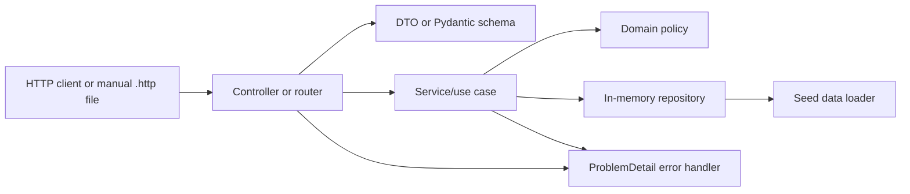

# Partner Source Implementation Schematic And Task Sequence

This file is a reference schematic for the Partner Source API implementation.

It is not execution authority. Use the numbered build books for current human build steps:

- `../../partner-source-springboot/build-sequence/00-index.md`
- `../../partner-source-fastapi/build-sequence/00-index.md`
- `../../parity/build-sequence/00-index.md`

## Core Rule

Both implementations must build the same API behavior from the same contract.

```text
Shared OpenAPI contract
  -> shared seed scenarios
  -> shared domain rules
  -> shared error envelope
  -> Spring Boot reference implementation
  -> FastAPI parity implementation
  -> same manual HTTP checklist
```

Spring Boot and FastAPI are different frameworks. They should not become different products.

## Decisions Already Mapped

| Decision | Spring Boot implementation | FastAPI implementation |
|---|---|---|
| Contract-first API | Use the shared OpenAPI as the behavior target. Write code by hand first. | Use the shared OpenAPI as the behavior target. Write code by hand first. |
| Separate modules | Future module name: `partner-source-springboot`. | Future module name: `partner-source-fastapi`. |
| CI/CD starts first | Create the module skeleton, one tiny test, and a GitHub Actions workflow before real endpoint work. | Create the module skeleton, one tiny test, and a GitHub Actions workflow before real endpoint work. |
| Separate CI/CD | Maven pipeline for this module only. | Python test pipeline for this module only. |
| TDD workflow | Red-green-refactor for every behavior, then local full test run, then CI gate. | Red-green-refactor for every behavior, then local full test run, then CI gate. |
| Beginner-readable code | Thin controllers, clear services, plain domain rules. | Thin routers, clear services, plain domain rules. |
| Persistence | In-memory repositories only for Slice 1. No JPA, H2, or PostgreSQL yet. | In-memory repositories only for Slice 1. No SQLAlchemy or PostgreSQL yet. |
| API validation | Jakarta Validation annotations plus centralized error mapping. | FastAPI `Path`, `Query`, and Pydantic validation plus centralized error mapping. |
| Error envelope | `@RestControllerAdvice` returns `ProblemDetail` plus `errorCode` and `correlationId`. | FastAPI exception handlers return the same ProblemDetail-style JSON. |
| Health/readiness | Custom `/health` and `/ready` controllers. No Actuator for Slice 1. | Custom `/health` and `/ready` router functions. |
| Testing | JUnit/Spring Boot Test/MockMvc after domain and service tests. | pytest/FastAPI TestClient after domain and service tests. |

## Platform Dependencies

### Spring Boot

Use this starting dependency set when the Spring Boot module is created:

| Need | Dependency/tool |
|---|---|
| Java runtime | Java 21 LTS |
| Build tool | Maven |
| Build wrapper | Maven Wrapper, so CI and local commands use the same entrypoint |
| HTTP API | `spring-boot-starter-web` |
| Request validation | `spring-boot-starter-validation` |
| Testing | `spring-boot-starter-test` |
| First local command | `./mvnw test` or `mvn test` |
| Later full local command | `./mvnw verify` or `mvn verify` |
| Contract file | `partner-source.v1.yaml` from `../contracts/openapi/` |

Do not add these in Slice 1 unless there is a deliberate new decision:

- `spring-boot-starter-data-jpa`
- database drivers
- Spring Security
- Spring Boot Actuator
- OpenAPI server-code generation
- messaging or async worker libraries

### FastAPI

Use this starting dependency set when the FastAPI module is created:

| Need | Dependency/tool |
|---|---|
| Python runtime | Python 3.12 or newer |
| HTTP API | `fastapi` |
| Local server | `uvicorn[standard]` |
| Request/response schemas | Pydantic models through FastAPI |
| Testing | `pytest` |
| HTTP test client support | `httpx` |
| Optional early quality tool | `ruff`, after the first pytest pipeline is green |
| Optional later coverage tool | `pytest-cov`, after the basic TDD rhythm is comfortable |
| First local command | `python -m pytest` |
| Contract file | `partner-source.v1.yaml` from `../contracts/openapi/` |

Do not add these in Slice 1 unless there is a deliberate new decision:

- SQLAlchemy
- Alembic
- Celery or background workers
- authentication packages
- OpenAPI server-code generation
- deployment-only packages

## Implementation Architecture



Beginner rule: put web-framework code at the edge. Put business decisions in domain policies and services.

## Shared Domain Model

These concepts should exist in both implementations, even if the exact language syntax differs.

| Concept | Purpose | Spring Boot shape | FastAPI shape |
|---|---|---|---|
| `DeliveryOrder` | Current order state and delivery facts. | Java domain class or record. | Python dataclass or plain class. |
| `DeliveryDriver` | Seeded driver profile and availability. | Java domain class or record. | Python dataclass or plain class. |
| `DeliveryAssignment` | Links order and driver. | Java domain class or record. | Python dataclass or plain class. |
| `OrderStatusEvent` | Append-only timeline event. | Java domain class or record. | Python dataclass or plain class. |
| `LocationSnapshot` | Optional location attached to status and events. | Java value object. | Python dataclass or Pydantic model at API edge. |
| `DeliveryWindow` | Planned start/end time. | Java value object. | Python dataclass or Pydantic model at API edge. |
| `OrderStatus` | Order lifecycle enum. | Java `enum`. | Python `Enum`. |
| `StatusTransitionPolicy` | Allows or rejects status moves. | Plain Java class. | Plain Python class/function. |
| `AssignmentAuthorizationPolicy` | Decides whether a driver can update an order. | Plain Java class. | Plain Python class/function. |

The API response DTOs/schemas should match the OpenAPI JSON fields. Internal domain objects may be simpler and mapped into the response shape by services or mappers.

## Endpoint Implementation Map

| OpenAPI operation | Spring Boot class and method | FastAPI function | Service/use case | Main response schema |
|---|---|---|---|---|
| `getOrderStatus` | `OrderStatusController.getOrderStatus` | `get_order_status` in `api/orders.py` | `OrderStatusService.getStatus` / `get_status` | `OrderStatusResponse` |
| `getOrderTimeline` | `OrderTimelineController.getOrderTimeline` | `get_order_timeline` in `api/orders.py` | `OrderTimelineService.getTimeline` / `get_timeline` | `OrderTimelineResponse` |
| `getDriver` | `DriverController.getDriver` | `get_driver` in `api/drivers.py` | `DriverService.getDriver` / `get_driver` | `DriverResponse` |
| `listDriverAssignments` | `DriverAssignmentController.listAssignments` | `list_driver_assignments` in `api/drivers.py` | `DriverAssignmentService.listAssignments` / `list_assignments` | `DriverAssignmentsResponse` |
| `createOrderStatusEvent` | `StatusEventController.createStatusEvent` | `create_order_status_event` in `api/orders.py` | `StatusEventService.createStatusEvent` / `create_status_event` | `StatusEventResponse` |
| `getHealth` | `HealthController.getHealth` | `get_health` in `api/health.py` | no domain service needed | `HealthResponse` |
| `getReadiness` | `ReadinessController.getReadiness` | `get_readiness` in `api/health.py` | `ReadinessService` or seed checks | `ReadinessResponse` |

## Spring Boot Package Schematic

Use package name `com.waypoint.partnersource` unless the implementation repo chooses a stricter naming convention.

```text
src/main/java/com/waypoint/partnersource
  PartnerSourceApplication.java

  order
    api
      OrderStatusController.java
      OrderTimelineController.java
      StatusEventController.java
      dto
        OrderStatusResponse.java
        OrderTimelineResponse.java
        TimelineEventResponse.java
        CreateStatusEventRequest.java
        StatusEventResponse.java
        LocationSnapshotResponse.java
        DeliveryWindowResponse.java
        AssignedDriverSummaryResponse.java
    domain
      DeliveryOrder.java
      OrderStatus.java
      ActorType.java
      OrderStatusEvent.java
      LocationSnapshot.java
      DeliveryWindow.java
      StatusTransitionPolicy.java
    repository
      OrderRepository.java
      StatusEventRepository.java
      InMemoryOrderRepository.java
      InMemoryStatusEventRepository.java
    service
      OrderStatusService.java
      OrderTimelineService.java
      StatusEventService.java
      OrderResponseMapper.java

  driver
    api
      DriverController.java
      DriverAssignmentController.java
      dto
        DriverResponse.java
        DriverAssignmentsResponse.java
        DriverAssignmentItemResponse.java
    domain
      DeliveryDriver.java
      DriverAvailabilityStatus.java
    repository
      DriverRepository.java
      InMemoryDriverRepository.java
    service
      DriverService.java
      DriverAssignmentService.java
      DriverResponseMapper.java

  assignment
    domain
      DeliveryAssignment.java
      AssignmentStatus.java
      AssignmentAuthorizationPolicy.java
    repository
      AssignmentRepository.java
      InMemoryAssignmentRepository.java

  shared
    error
      ApiExceptionHandler.java
      PartnerSourceException.java
      ErrorCode.java
      ProblemDetailFactory.java
      CorrelationIdFilter.java
    health
      HealthController.java
      ReadinessController.java
      ReadinessService.java
    seed
      SeedDataLoader.java
      SeedDataManifest.java
      SeedDataStore.java
```

Recommended test structure:

```text
src/test/java/com/waypoint/partnersource
  order/domain/StatusTransitionPolicyTest.java
  assignment/domain/AssignmentAuthorizationPolicyTest.java
  order/repository/InMemoryOrderRepositoryTest.java
  driver/repository/InMemoryDriverRepositoryTest.java
  order/service/OrderStatusServiceTest.java
  order/service/StatusEventServiceTest.java
  order/api/OrderStatusControllerTest.java
  driver/api/DriverControllerTest.java
  shared/error/ApiExceptionHandlerTest.java
  PartnerSourceContractSmokeTest.java
```

## FastAPI Package Schematic

Use package directory `app` unless the implementation repo chooses a stricter naming convention.

```text
app
  __init__.py
  main.py

  api
    __init__.py
    orders.py
    drivers.py
    health.py

  schemas
    __init__.py
    orders.py
    drivers.py
    shared.py
    errors.py

  domain
    __init__.py
    orders.py
    drivers.py
    assignments.py
    policies.py

  repositories
    __init__.py
    orders.py
    drivers.py
    assignments.py
    status_events.py

  services
    __init__.py
    order_status.py
    order_timeline.py
    status_events.py
    driver_profile.py
    driver_assignments.py
    readiness.py

  seed
    __init__.py
    manifest.py
    loader.py
    store.py

  errors
    __init__.py
    exceptions.py
    handlers.py
```

Recommended test structure:

```text
tests
  domain
    test_status_transition_policy.py
    test_assignment_authorization_policy.py
  repositories
    test_orders_repository.py
    test_drivers_repository.py
  services
    test_order_status_service.py
    test_status_events_service.py
  api
    test_orders_api.py
    test_drivers_api.py
    test_health_api.py
  test_contract_smoke.py
```

## Code Schematics

These snippets show the intended shape. They are not final copy-paste code.

### Status Transition Policy

Spring Boot:

```java
public final class StatusTransitionPolicy {
    private static final Map<OrderStatus, Set<OrderStatus>> ALLOWED = Map.of(
        OrderStatus.CREATED, Set.of(OrderStatus.CONFIRMED, OrderStatus.CANCELLED),
        OrderStatus.CONFIRMED, Set.of(OrderStatus.PICKED_UP, OrderStatus.CANCELLED),
        OrderStatus.PICKED_UP, Set.of(OrderStatus.IN_TRANSIT),
        OrderStatus.IN_TRANSIT, Set.of(OrderStatus.OUT_FOR_DELIVERY),
        OrderStatus.OUT_FOR_DELIVERY, Set.of(OrderStatus.DELIVERED)
    );

    public boolean canTransition(OrderStatus current, OrderStatus next) {
        return ALLOWED.getOrDefault(current, Set.of()).contains(next);
    }
}
```

FastAPI/Python:

```python
ALLOWED_TRANSITIONS: dict[OrderStatus, set[OrderStatus]] = {
    OrderStatus.CREATED: {OrderStatus.CONFIRMED, OrderStatus.CANCELLED},
    OrderStatus.CONFIRMED: {OrderStatus.PICKED_UP, OrderStatus.CANCELLED},
    OrderStatus.PICKED_UP: {OrderStatus.IN_TRANSIT},
    OrderStatus.IN_TRANSIT: {OrderStatus.OUT_FOR_DELIVERY},
    OrderStatus.OUT_FOR_DELIVERY: {OrderStatus.DELIVERED},
}


class StatusTransitionPolicy:
    def can_transition(self, current: OrderStatus, next_status: OrderStatus) -> bool:
        return next_status in ALLOWED_TRANSITIONS.get(current, set())
```

### Spring Boot Status Lookup

Controller:

```java
@RestController
@RequestMapping("/api/v1/orders")
@Validated
public class OrderStatusController {
    private final OrderStatusService service;

    public OrderStatusController(OrderStatusService service) {
        this.service = service;
    }

    @GetMapping("/{orderId}/status")
    public OrderStatusResponse getOrderStatus(
        @PathVariable @Pattern(regexp = "^ORD-[0-9]{4}$") String orderId
    ) {
        return service.getStatus(orderId);
    }
}
```

DTO:

```java
public record OrderStatusResponse(
    String orderId,
    OrderStatus currentStatus,
    String statusLabel,
    LocationSnapshotResponse currentLocation,
    OffsetDateTime estimatedDeliveryAt,
    DeliveryWindowResponse deliveryWindow,
    AssignedDriverSummaryResponse assignedDriver,
    OffsetDateTime lastUpdatedAt
) {}
```

Service:

```java
@Service
public class OrderStatusService {
    private final OrderRepository orderRepository;
    private final DriverRepository driverRepository;

    public OrderStatusService(
        OrderRepository orderRepository,
        DriverRepository driverRepository
    ) {
        this.orderRepository = orderRepository;
        this.driverRepository = driverRepository;
    }

    public OrderStatusResponse getStatus(String orderId) {
        DeliveryOrder order = orderRepository.findById(orderId)
            .orElseThrow(() -> PartnerSourceException.orderNotFound(orderId));

        return OrderResponseMapper.toStatusResponse(order, driverRepository);
    }
}
```

Repository:

```java
public interface OrderRepository {
    Optional<DeliveryOrder> findById(String orderId);
    void save(DeliveryOrder order);
}

@Repository
public class InMemoryOrderRepository implements OrderRepository {
    private final Map<String, DeliveryOrder> orders;

    public InMemoryOrderRepository(SeedDataStore seedDataStore) {
        this.orders = new LinkedHashMap<>(seedDataStore.ordersById());
    }

    @Override
    public Optional<DeliveryOrder> findById(String orderId) {
        return Optional.ofNullable(orders.get(orderId));
    }

    @Override
    public void save(DeliveryOrder order) {
        orders.put(order.orderId(), order);
    }
}
```

### FastAPI Status Lookup

Schema:

```python
class OrderStatus(str, Enum):
    CREATED = "CREATED"
    CONFIRMED = "CONFIRMED"
    PICKED_UP = "PICKED_UP"
    IN_TRANSIT = "IN_TRANSIT"
    OUT_FOR_DELIVERY = "OUT_FOR_DELIVERY"
    DELIVERY_ATTEMPTED = "DELIVERY_ATTEMPTED"
    DELIVERED = "DELIVERED"
    CANCELLED = "CANCELLED"


class OrderStatusResponse(BaseModel):
    model_config = ConfigDict(extra="forbid")

    orderId: str = Field(pattern=r"^ORD-[0-9]{4}$")
    currentStatus: OrderStatus
    statusLabel: str
    currentLocation: LocationSnapshot | None = None
    estimatedDeliveryAt: datetime | None = None
    deliveryWindow: DeliveryWindow
    assignedDriver: AssignedDriverSummary | None = None
    lastUpdatedAt: datetime
```

Router:

```python
router = APIRouter(prefix="/api/v1/orders", tags=["Orders"])


@router.get("/{order_id}/status", response_model=OrderStatusResponse)
def get_order_status(
    order_id: Annotated[str, Path(pattern=r"^ORD-[0-9]{4}$")],
    service: Annotated[OrderStatusService, Depends(get_order_status_service)],
) -> OrderStatusResponse:
    return service.get_status(order_id)
```

Service:

```python
class OrderStatusService:
    def __init__(
        self,
        order_repository: OrderRepository,
        driver_repository: DriverRepository,
    ) -> None:
        self.order_repository = order_repository
        self.driver_repository = driver_repository

    def get_status(self, order_id: str) -> OrderStatusResponse:
        order = self.order_repository.find_by_id(order_id)
        if order is None:
            raise PartnerSourceError.order_not_found(order_id)

        return map_order_status_response(order, self.driver_repository)
```

Dependency provider:

```python
def get_order_status_service() -> OrderStatusService:
    store = get_seed_data_store()
    return OrderStatusService(
        order_repository=OrderRepository(store),
        driver_repository=DriverRepository(store),
    )
```

### Shared Error Handling

Spring Boot:

```java
@RestControllerAdvice
public class ApiExceptionHandler {
    @ExceptionHandler(PartnerSourceException.class)
    public ResponseEntity<ProblemDetail> handlePartnerSourceException(
        PartnerSourceException exception,
        HttpServletRequest request
    ) {
        ProblemDetail body = ProblemDetail.forStatusAndDetail(
            exception.httpStatus(),
            exception.detail()
        );

        body.setType(URI.create(exception.type()));
        body.setTitle(exception.title());
        body.setInstance(URI.create(request.getRequestURI()));
        body.setProperty("errorCode", exception.errorCode().name());
        body.setProperty("correlationId", correlationIdFrom(request));

        return ResponseEntity
            .status(exception.httpStatus())
            .contentType(MediaType.APPLICATION_PROBLEM_JSON)
            .body(body);
    }
}
```

FastAPI:

```python
@app.exception_handler(PartnerSourceError)
async def partner_source_error_handler(
    request: Request,
    exc: PartnerSourceError,
) -> JSONResponse:
    return JSONResponse(
        status_code=exc.status_code,
        media_type="application/problem+json",
        content={
            "type": exc.type,
            "title": exc.title,
            "status": exc.status_code,
            "detail": exc.detail,
            "instance": request.url.path,
            "errorCode": exc.error_code,
            "correlationId": correlation_id_from(request),
        },
    )
```

### Application Startup

Spring Boot:

```java
@SpringBootApplication
public class PartnerSourceApplication {
    public static void main(String[] args) {
        SpringApplication.run(PartnerSourceApplication.class, args);
    }
}
```

FastAPI:

```python
app = FastAPI(title="Waypoint Partner Source API", version="1.0.0")
app.include_router(orders.router)
app.include_router(drivers.router)
app.include_router(health.router)
register_exception_handlers(app)
```

## Testing Schematic

| Test target | Spring Boot | FastAPI |
|---|---|---|
| Domain policies | Plain JUnit tests. No Spring context. | Plain pytest tests. No FastAPI app. |
| Repositories | JUnit tests against seeded in-memory repositories. | pytest tests against seeded repository classes. |
| Services | JUnit tests with repositories passed directly. | pytest tests with repositories passed directly. |
| API routes | `@WebMvcTest` or `MockMvc` controller tests. | `TestClient(app)` route tests. |
| Integration | `@SpringBootTest` once the app wiring matters. | `TestClient` against full app after routers/handlers are registered. |
| Contract smoke | Assert required fields/status/error codes from HTTP calls. | Assert the same required fields/status/error codes from HTTP calls. |

## Expert Research Synthesis

The Spring Boot, FastAPI, CI/CD, and TDD review all point to the same correction:

```text
module skeleton
  -> tiny automated test
  -> CI pipeline proves tests run
  -> first failing behavior test
  -> smallest implementation
  -> refactor
  -> local full test run
  -> push and let CI gate it
  -> next behavior
```

Important beginner distinction:

```text
TDD happens locally.
CI proves the result after each slice.
CD waits until there is a deployment target.
```

For now, call the early automation a CI/CD foundation, but treat it as CI. It should install dependencies and run tests. Docker publishing, cloud deployment, secrets, environments, release automation, and artifact promotion are deferred.

## Red-Green-Refactor Practice

Use this loop for every behavior:

| Step | Meaning | Spring Boot command | FastAPI command |
|---|---|---|---|
| Red | Write one failing test that proves missing behavior. | Run the focused JUnit test. | Run the focused pytest test. |
| Green | Write the smallest code that passes. | Run the focused JUnit test again. | Run the focused pytest test again. |
| Refactor | Clean names, remove duplication, keep controllers/routers thin. | Re-run focused test. | Re-run focused test. |
| Local gate | Run the module test suite before commit. | `./mvnw test` first, `./mvnw verify` later. | `python -m pytest`. |
| CI gate | Push or open/update a pull request and let GitHub Actions verify it. | Spring Boot workflow. | FastAPI workflow. |

A good red test should fail because the wanted behavior is missing, not because the test environment is broken.

Examples:

- Good red test: `ORD-9999` returns `404` with `ORDER_NOT_FOUND`.
- Good red test: `OUT_FOR_DELIVERY -> DELIVERED` is allowed.
- Weak red test: a test that only checks Spring or FastAPI can start.
- Weak red test: a mock-only test that proves a method was called but not that contract behavior works.

## What Not To Over-Test

Do not test the frameworks themselves. Test Waypoint behavior.

| Prefer testing | Avoid spending much time on |
|---|---|
| status transition rules | Java records, Python dataclasses, getters, and setters |
| assignment authorization | every annotation or Pydantic/Jakarta internal behavior |
| seed lookup and missing IDs | giant app-context tests for every class |
| service error cases | mock-heavy "called exactly once" tests without behavior value |
| HTTP status and JSON shape | duplicating every framework validation test |
| shared `ProblemDetail` fields | tests that only prove Spring/FastAPI works |
| mutation after status event creation | deployment or artifact steps before CI is stable |

## CI Foundation

Use two separate GitHub Actions workflows if both modules live in one repository.

If the modules become separate repositories, each repository can simply use `.github/workflows/ci.yml`.

### Spring Boot CI Foundation

```yaml
name: Partner Source Spring Boot CI

on:
  pull_request:
    paths:
      - "pilot_phase2_poc/partner-source/partner-source-springboot/**"
      - "pilot_phase2_poc/partner-source/docs/**"
      - "pilot_phase2_poc/partner-source/AGREED_SPEC.md"
      - ".github/workflows/partner-source-springboot-ci.yml"
  push:
    branches: [main]
    paths:
      - "pilot_phase2_poc/partner-source/partner-source-springboot/**"
      - "pilot_phase2_poc/partner-source/docs/**"
      - "pilot_phase2_poc/partner-source/AGREED_SPEC.md"
      - ".github/workflows/partner-source-springboot-ci.yml"

permissions:
  contents: read

jobs:
  test:
    runs-on: ubuntu-latest
    defaults:
      run:
        working-directory: pilot_phase2_poc/partner-source/partner-source-springboot
    steps:
      - uses: actions/checkout@v4
      - uses: actions/setup-java@v4
        with:
          distribution: temurin
          java-version: "21"
          cache: maven
      - run: chmod +x ./mvnw
      - run: ./mvnw test
```

Start with `./mvnw test`. Move to `./mvnw verify` after the module has meaningful integration or contract checks.

### FastAPI CI Foundation

```yaml
name: Partner Source FastAPI CI

on:
  pull_request:
    paths:
      - "pilot_phase2_poc/partner-source/partner-source-fastapi/**"
      - "pilot_phase2_poc/partner-source/docs/**"
      - "pilot_phase2_poc/partner-source/AGREED_SPEC.md"
      - ".github/workflows/partner-source-fastapi-ci.yml"
  push:
    branches: [main]
    paths:
      - "pilot_phase2_poc/partner-source/partner-source-fastapi/**"
      - "pilot_phase2_poc/partner-source/docs/**"
      - "pilot_phase2_poc/partner-source/AGREED_SPEC.md"
      - ".github/workflows/partner-source-fastapi-ci.yml"

permissions:
  contents: read

jobs:
  test:
    runs-on: ubuntu-latest
    defaults:
      run:
        working-directory: pilot_phase2_poc/partner-source/partner-source-fastapi
    steps:
      - uses: actions/checkout@v4
      - uses: actions/setup-python@v5
        with:
          python-version: "3.12"
          cache: pip
      - run: python -m pip install --upgrade pip
      - run: pip install -r requirements.txt -r requirements-dev.txt
      - run: python -m pytest
```

Add `ruff check` only after the basic pytest pipeline is already green. Add coverage reports after the team understands normal test failures.

## Task Sequence

Use a CI-first, TDD-always approach:

1. Make the test runner and pipeline work.
2. Write a failing test for one small behavior.
3. Implement the smallest code that passes.
4. Refactor while tests stay green.
5. Run the local module test suite.
6. Let the module pipeline confirm the slice.
7. Mirror the same behavior in the other framework.

### Phase 0 - Shared Preparation

- [ ] Confirm the OpenAPI file is the only API contract source.
- [ ] Confirm the shared error contract is the only error envelope source.
- [ ] Confirm seed records in `data-and-seed-handoff.md`.
- [ ] Resolve the `ORD-1003` invalid-transition fixture detail before coding `POST /status-events`.
- [ ] Decide where `partner-source-springboot` and `partner-source-fastapi` will live.
- [ ] Decide whether each module references the shared OpenAPI file directly or carries a synced copy with provenance.
- [ ] Confirm the first automation goal is CI, not deployment.

### Phase 1 - Spring Boot Pipeline Proof

- [ ] Create `partner-source-springboot`.
- [ ] Add Java 21, Maven Wrapper, Spring Web, Spring Validation, and Spring Boot Test.
- [ ] Add `PartnerSourceApplication`.
- [ ] Add the package skeleton under `com.waypoint.partnersource`.
- [ ] Add one tiny test that proves the test runner works.
- [ ] Run the tiny test locally and confirm it passes.
- [ ] Add `partner-source-springboot-ci.yml`.
- [ ] Push or open a draft PR and confirm the Spring Boot workflow runs green.

This phase teaches:

```text
project skeleton -> local test command -> GitHub Actions workflow -> green CI
```

Do not add domain rules or endpoints until this is green.

### Phase 2 - FastAPI Pipeline Proof

- [ ] Create `partner-source-fastapi`.
- [ ] Add Python 3.12 setup.
- [ ] Add `fastapi`, `uvicorn[standard]`, `pytest`, and `httpx`.
- [ ] Add `requirements.txt` and `requirements-dev.txt`, or the chosen equivalent.
- [ ] Add `app/main.py` and empty modules for `api`, `schemas`, `domain`, `repositories`, `services`, `seed`, and `errors`.
- [ ] Add one tiny `TestClient` test that proves pytest and the app import work.
- [ ] Run `python -m pytest` locally and confirm it passes.
- [ ] Add `partner-source-fastapi-ci.yml`.
- [ ] Push or open a draft PR and confirm the FastAPI workflow runs green.

Do not add real API behavior until this is green.

### Phase 3 - First Real TDD Slice: Status Transition Policy

- [ ] Spring Boot red: write `StatusTransitionPolicyTest` for one allowed move, such as `OUT_FOR_DELIVERY -> DELIVERED`.
- [ ] Spring Boot green: add `OrderStatus` and the smallest `StatusTransitionPolicy` code.
- [ ] Spring Boot refactor: make the transition table readable.
- [ ] Spring Boot gate: run focused test, then `./mvnw test`.
- [ ] FastAPI red: write the matching pytest test.
- [ ] FastAPI green: add `OrderStatus` and `StatusTransitionPolicy`.
- [ ] FastAPI refactor: make the transition table readable.
- [ ] FastAPI gate: run focused test, then `python -m pytest`.
- [ ] Push and confirm both pipelines stay green.

### Phase 4 - Assignment Authorization Policy

- [ ] Spring Boot red: test assigned driver can update assigned order.
- [ ] Spring Boot red: test unassigned driver is rejected.
- [ ] Spring Boot red: test the completed-assignment edge case agreed in Phase 0.
- [ ] Spring Boot green/refactor/gate.
- [ ] FastAPI mirrors the same tests and behavior.
- [ ] Push and confirm both pipelines stay green.

### Phase 5 - Seed Store And In-Memory Repositories

- [ ] Spring Boot red: test `ORD-1001` exists.
- [ ] Spring Boot red: test `ORD-9999` is missing.
- [ ] Spring Boot red: test `DRV-2001` exists.
- [ ] Spring Boot red: test `DRV-9999` is missing.
- [ ] Spring Boot green: add `SeedDataStore`, seed loader, and repositories.
- [ ] Spring Boot refactor/gate.
- [ ] FastAPI mirrors the same seed store, repositories, and tests.
- [ ] Push and confirm both pipelines stay green.

### Phase 6 - First HTTP Slice: `/health`

- [ ] Spring Boot red: write a controller/API test expecting `GET /health` to return `200` and `status = UP`.
- [ ] Spring Boot green: add `HealthController`.
- [ ] Spring Boot refactor/gate.
- [ ] FastAPI red: write a `TestClient` test expecting the same response.
- [ ] FastAPI green: add the health router.
- [ ] FastAPI refactor/gate.
- [ ] Push and confirm both pipelines stay green.

This is the first HTTP endpoint because it is small and teaches controller/router tests without domain complexity.

### Phase 7 - Readiness Slice: `/ready`

- [ ] Spring Boot red: test `GET /ready` returns `READY` when seed data is loaded.
- [ ] Spring Boot green: add `ReadinessService` and `ReadinessController`.
- [ ] Spring Boot refactor/gate.
- [ ] FastAPI mirrors readiness service, router, and tests.
- [ ] Push and confirm both pipelines stay green.

### Phase 8 - First Contract Endpoint: Order Status Lookup

- [ ] Spring Boot red: service test for `ORD-1001` returning `OUT_FOR_DELIVERY`.
- [ ] Spring Boot green: add `OrderStatusService`.
- [ ] Spring Boot red: controller test for `GET /api/v1/orders/ORD-1001/status`.
- [ ] Spring Boot green: add `OrderStatusResponse`, nested DTOs, mapper, and controller.
- [ ] Spring Boot red: test `ORD-9999` returns `ORDER_NOT_FOUND`.
- [ ] Spring Boot green: add the minimal not-found exception path.
- [ ] Spring Boot refactor/gate.
- [ ] FastAPI mirrors schemas, service, route, success test, and not-found test.
- [ ] Push and confirm both pipelines stay green.

### Phase 9 - Shared Error Envelope

- [ ] Spring Boot red: test an error response includes `type`, `title`, `status`, `detail`, `instance`, `errorCode`, and `correlationId`.
- [ ] Spring Boot green: add `ErrorCode`, `PartnerSourceException`, `ApiExceptionHandler`, and correlation ID handling.
- [ ] Spring Boot refactor/gate.
- [ ] FastAPI red: write the same error-envelope test.
- [ ] FastAPI green: add `PartnerSourceError`, exception handlers, and correlation ID handling.
- [ ] FastAPI refactor/gate.
- [ ] Push and confirm both pipelines stay green.

This comes after the first negative API path so the error contract is grounded in a real endpoint.

### Phase 10 - Timeline Endpoint

- [ ] Spring Boot red: service test proves events for `ORD-1001` are chronological.
- [ ] Spring Boot red: API test proves pagination fields exist.
- [ ] Spring Boot green/refactor/gate.
- [ ] FastAPI mirrors timeline schemas, service, route, and tests.
- [ ] Push and confirm both pipelines stay green.

### Phase 11 - Driver Profile Endpoint

- [ ] Spring Boot red: test `DRV-2001` returns a driver profile.
- [ ] Spring Boot red: test `DRV-9999` returns `DRIVER_NOT_FOUND`.
- [ ] Spring Boot green/refactor/gate.
- [ ] FastAPI mirrors the same behavior and tests.
- [ ] Push and confirm both pipelines stay green.

### Phase 12 - Driver Assignments Endpoint

- [ ] Spring Boot red: test `DRV-2001` returns two active assignment items.
- [ ] Spring Boot red: test `DRV-2003` returns an empty `items` array.
- [ ] Spring Boot green/refactor/gate.
- [ ] FastAPI mirrors the same behavior and tests.
- [ ] Push and confirm both pipelines stay green.

### Phase 13 - Create Status Event Endpoint

- [ ] Spring Boot red: test assigned driver can create a `DELIVERED` event for `ORD-1001`.
- [ ] Spring Boot red: test unassigned driver gets `403 ORDER_NOT_ASSIGNED_TO_DRIVER`.
- [ ] Spring Boot red: test missing order gets `404 ORDER_NOT_FOUND`.
- [ ] Spring Boot red: test missing driver gets `404 DRIVER_NOT_FOUND`.
- [ ] Spring Boot red: test invalid transition gets `409 INVALID_STATUS_TRANSITION`.
- [ ] Spring Boot red: test semantic event failure gets `422 INVALID_STATUS_EVENT`.
- [ ] Spring Boot green: implement request DTO, validation, service flow, append event, and update current order status.
- [ ] Spring Boot refactor/gate.
- [ ] FastAPI mirrors request schema, validation, service flow, mutation, and tests.
- [ ] Push and confirm both pipelines stay green.

This endpoint is last because it combines validation, authorization, transition rules, mutation, event append, and error handling.

### Phase 14 - Contract And Manual Parity Checks

- [ ] Run the shared manual HTTP checklist against Spring Boot.
- [ ] Run the shared manual HTTP checklist against FastAPI.
- [ ] Add contract smoke tests for required fields, enum values, HTTP statuses, and `errorCode` values.
- [ ] Compare Spring Boot and FastAPI responses for the same seed requests.
- [ ] Fix implementation drift before adding new scope.
- [ ] Move Spring Boot CI from `test` to `verify` if contract checks are bound to the Maven verify phase.
- [ ] Keep FastAPI CI running `python -m pytest`; add contract/parity test paths inside pytest.

### Phase 15 - CI Growth, CD Still Deferred

- [ ] Add OpenAPI validation after the contract checks have a home.
- [ ] Add test reports if they help debugging.
- [ ] Add coverage only after tests are meaningful.
- [ ] Add linting after the first implementation flow is comfortable.
- [ ] Defer Docker image publishing.
- [ ] Defer deployment environments and secrets.
- [ ] Defer merged full-application CI until separate module pipelines are stable.

## Per-Slice Checklist

Use this checklist every time:

- [ ] Read the OpenAPI operation or domain rule.
- [ ] Pick one behavior.
- [ ] Write one failing test.
- [ ] Confirm the failure is meaningful.
- [ ] Implement the smallest code that passes.
- [ ] Refactor while keeping tests green.
- [ ] Run the focused test.
- [ ] Run the module test command.
- [ ] Push and let CI confirm the slice.
- [ ] Mirror the same behavior in the other implementation.
- [ ] Update docs only if the contract or planned behavior deliberately changes.

## Framework References

- Spring MVC request mapping: https://docs.spring.io/spring-framework/reference/web/webmvc/mvc-controller/ann-requestmapping.html
- Spring MVC error responses and `ProblemDetail`: https://docs.spring.io/spring-framework/reference/web/webmvc/mvc-ann-rest-exceptions.html
- Spring Boot validation: https://docs.spring.io/spring-boot/reference/io/validation.html
- Spring Boot testing: https://docs.spring.io/spring-boot/reference/testing/spring-boot-applications.html
- FastAPI bigger applications and `APIRouter`: https://fastapi.tiangolo.com/tutorial/bigger-applications/
- FastAPI dependencies: https://fastapi.tiangolo.com/tutorial/dependencies/
- FastAPI request body fields and Pydantic `Field`: https://fastapi.tiangolo.com/tutorial/body-fields/
- FastAPI error handling: https://fastapi.tiangolo.com/tutorial/handling-errors/
- FastAPI testing: https://fastapi.tiangolo.com/tutorial/testing/
